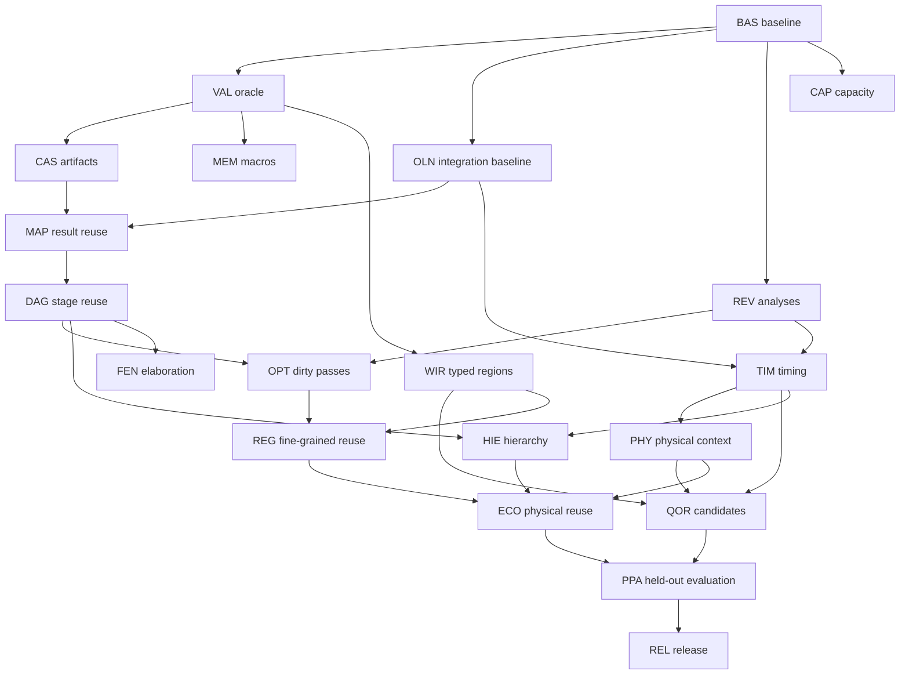

# Yosys ASIC execution plan

Version: 1.0 · Created: 2026-09-07 · Repository: `phoenix-hacking/yosys-dev`.

**Start here:** [Progress dashboard](ASIC_PROGRESS.md). Background: [synthesis research](docs/asic-roadmap/RESEARCH_REPORT.md) and [OpenLane integration](docs/asic-roadmap/OPENLANE_INTEGRATION_REPORT.md).

**Current implementation status:** this document creates a plan, not the features it describes. All 240 core acceptance tasks and 48 research acceptance tasks below begin unchecked. No speedup, PPA improvement, synthesis test pass, or commercial parity is claimed by publishing documentation.

## 1. Mission and non-negotiable scope

Improve Yosys itself as an ASIC synthesis compiler for CPU, DSP, GPU/SIMD, accelerator, interconnect, memory-heavy and heterogeneous SoC RTL. Prioritize safe incremental compilation, cold-build capacity/runtime, and better standard-cell implementations. OpenLane is the intended orchestration and physical-validation environment.

The primary control is a pinned, unmodified upstream Yosys build. Commercial synthesis tools are capability references and optional matched comparison targets, not dependencies for making measurable progress.

Yosys owns elaboration/synthesis dependencies, reusable artifacts, maintained analyses, synthesis optimization, technology mapping, candidate generation, proof obligations and logical correspondence. OpenSTA owns timing analysis. OpenROAD owns placement, CTS, routing, physical state and extraction. OpenLane owns flow composition, configuration, state/artifact handoff and flow-level metrics.

Do not replace RTLIL, invent a new STA or placer/router, move the main synthesis implementation into OpenROAD, introduce FPGA optimization as a project requirement, or count a wrapper that merely skips whole invocations as the finished incremental compiler.

## 2. Authority, baseline and evidence discipline

The baseline observed before documentation publication is:

```text
Yosys commit: 435977e97008578a4532da60e70f75b5e88d076d
Tree:         619f1ede8b8fb31305838ed2593f0d06058f2c67
ABC gitlink:  a51bf4a7bb38ce06ea3a544b1463b40832213917
Commit date:  2026-09-04
```

This identifies source, not a verified build. OpenLane generation/commit, OpenROAD/OpenSTA, frontend, compilers, libraries, PDK, macro models, solver versions, recipes and hardware remain unpinned until BAS/OLN work lands. A blank field is a blocker, not permission to use latest.

The supplied reports are design rationale. This checklist is the execution contract. Actual evidence wins over both. Future file/API/command names are proposals until implemented; existing source anchors are starting points, not claims that new behavior already exists.

### Task states

The checkbox means **accepted complete** only. Track intermediate states in the dashboard or evidence record: `TODO`, `READY`, `IN_PROGRESS`, `BLOCKED`, `IMPLEMENTED_UNVERIFIED`, `VERIFIED`, `ACCEPTED`, `DEFERRED`. Only `ACCEPTED` is checked. A skipped or inconclusive required test does not qualify.

Each checked task must link an evidence record containing implementation commit/PR, exact toolchain lock, commands, input revisions/digests, test outcomes, metrics when relevant, reviewer/acceptance note and known limitations. Use `docs/asic-roadmap/evidence/<TASK-ID>.md` plus immutable external artifacts for large results. Those files do not exist yet.

Task counts are checklist coverage, not weighted engineering completion, time remaining, commercial parity or proof of readiness. Do not calculate progress from LOC, commits, calendar days, or documentation volume. Research is counted separately. Splitting tasks requires a logged scope change and preserved parent IDs.

### Definition of done for a work item

The intended code/configuration exists; the regression exposes the original problem; the new regression and required upstream tests pass; unsafe inputs fail or rebuild safely; resource/quality measurements are included where applicable; default behavior remains compatible or the change is explicitly opted in; documentation and evidence agree with actual behavior; no proprietary inputs are published.

## 3. Milestones and dependency map

| Milestone | Workstreams | Tasks | Acceptance outcome |
|---|---|---:|---|
| M0 | BAS, VAL, OLN | 36 | Reproducible stock/fork ASIC and OpenLane baseline; trustworthy oracle |
| M1 | CAS, MAP | 24 | One safe persistent mapping-result cache, tested through the real flow |
| M2 | DAG, REV, OPT | 36 | Native stage/module reuse and audited maintained analyses |
| M3 | CAP, MEM | 24 | Measured capacity improvements and strict ASIC memory policy |
| M4 | TIM, PHY | 24 | Constraint-safe timing and versioned physical feedback |
| M5 | WIR, QOR | 24 | Proved word-level alternatives with measured ASIC value |
| M6 | HIE, FEN, REG | 36 | Better hierarchy, elaboration reuse and within-module incrementality |
| M7 | ECO | 12 | Narrow, validated logical-to-physical ECO workflow |
| M8 | PPA, REL | 24 | Held-out results, recovery, reproducibility and supported-release envelope |
| Research | R01–R08 | 48 | Independently evaluated stretch hypotheses; not core release prerequisites |



This is a partial-order graph, not a demand to serialize every task. Capacity/memory profiling can proceed after the baseline. A basic partition cache does not wait for advanced timing-budgeted hierarchy. A basic OpenLane handoff comes early; physical optimization comes later.

## 4. Core execution backlog: 240 acceptance tasks

### W01 — BAS: pinned baseline and reproducible measurement

**Goal:** establish what the actual toolchain does before changing it. **Dependencies:** none. **Suggested role:** compiler/performance lead. **Source anchors:** baseline `CMakeLists.txt`, `.gitmodules`, `README.md`, `tests/`; planned `benchmarks/asic/`. **Exit gate:** reproducible build and run records, not a proposed lock file alone.

- [ ] BAS-01 — Write the baseline source record with Yosys commit/tree, ABC gitlink and all other submodule identities; verify objects exist and retain immutable references without moving the comparison baseline silently.
- [ ] BAS-02 — Create a versioned toolchain-lock schema covering compiler, flags, frontend/plugins, ABC, formal tools, OpenLane/OpenROAD/OpenSTA, PDK and library/model digests; reject missing required identities.
- [ ] BAS-03 — Audit source entry points from the report at the pinned revision; record actual classes/functions and active upstream overlap, distinguishing confirmed facilities from proposed files and inherited research claims.
- [ ] BAS-04 — Declare the first supported ASIC envelope: top/configuration, one library, flop/reset semantics, macro policy, allowed synthesis recipe and explicit unsupported constructs; publish the matching test matrix.
- [ ] BAS-05 — Build stock and fork in isolated worktrees/directories with matching flags and dependencies; prove the runner selects different requested binaries rather than finding the same executable twice.
- [ ] BAS-06 — Record executable/build fingerprints, feature availability, frontend help and mapper identity; add a deliberate wrong-binary test that must stop before benchmarking.
- [ ] BAS-07 — Run the baseline's documented upstream test targets; store pass/fail/skip counts and known failures without relabeling preexisting failures as new success or silently suppressing them.
- [ ] BAS-08 — Create a redistributable tiny ASIC library and functional models with combinational cells/flops; validate their logic and units before using them as a fast regression oracle.
- [ ] BAS-09 — Implement an isolated job runner with stdout/stderr, exit status, wall/CPU time, timeout and cancellation; ensure it terminates child ABC/solver processes and preserves failure artifacts.
- [ ] BAS-10 — Implement concurrent process-tree memory accounting or isolated cgroup accounting; document sampling, shared-memory limitations and peak definition; do not sum independent per-process peaks as a concurrent peak.
- [ ] BAS-11 — Emit schema-validated metrics with explicit null/missing reasons, host/thread limits and cache state; test malformed logs, partial results, NaN/units and failed-job reporting.
- [ ] BAS-12 — Run repeated clean trials, publish noise/variance and per-stage profiles, and identify the top three measured bottlenecks; lock aggregation and acceptance rules before optimizing those cases.

### W02 — VAL: edit replay, formal oracle and adversarial fixtures

**Goal:** detect stale or incorrect hardware, not only compare compiler logs. **Dependencies:** BAS build/runner/fixture support. **Suggested role:** formal/compiler engineer. **Anchors:** `tests/`, `passes/equiv/`, `passes/sat/`; planned replay/formal harness. **Exit gate:** known-wrong outputs fail and A→B histories are independently checked against B RTL.

- [ ] VAL-01 — Define a case/transition manifest containing source revisions, ordered files, defines, parameters, intended edit, expected invalidation, models, constraints and required proof level; validate incomplete cases.
- [ ] VAL-02 — Add mixed control, FIR/MAC, SIMD-lane and FIFO/interconnect microdesigns with observable outputs; confirm they retain the intended logic after synthesis and do not vanish through constants.
- [ ] VAL-03 — Implement isolated A population and B stock-clean/fork-clean/fork-incremental lanes; ensure no lane accidentally consumes another lane's outputs, environment or cache namespace.
- [ ] VAL-04 — Integrate pinned EQY/SBY or appropriate Yosys equivalence flows against intended B RTL; validate actual command syntax and proof semantics rather than copying illustrative report snippets unchecked.
- [ ] VAL-05 — Provide functional mapped-cell models and an explicit model-selection contract; test that empty blackboxes cannot accidentally turn a required correctness claim into a vacuous pass.
- [ ] VAL-06 — Classify pass, counterexample, timeout, resource exhaustion and infrastructure failure separately; propagate inconclusive required proofs as non-acceptance rather than success.
- [ ] VAL-07 — Define reset/init/X and safe-replacement assumptions; add signedness, truncation, enable, asynchronous/synchronous reset and latency fixtures that distinguish stronger equivalence from weaker refinement claims.
- [ ] VAL-08 — Seed wrong constants, swapped pins, off-by-one widths, wrong reset polarity and missing logic into candidate netlists; demonstrate that the oracle rejects each fault for the expected reason.
- [ ] VAL-09 — Add local/shared-module, parameter/generate, interface-width, package/include/define and memory-init edits; store expected dependency outcomes separately from measured compiler outcomes.
- [ ] VAL-10 — Add mapping-script, library-content-with-unchanged-timestamp, mapper-binary, SDC and exclusion-list changes; confirm the harness distinguishes semantic, mapping and analysis invalidation.
- [ ] VAL-11 — Replay A→B→C→A, branch divergence, delete/recreate-under-same-name, rename and interrupted/corrupt artifact scenarios; prevent stale output resurrection and invalid cross-revision proof reuse.
- [ ] VAL-12 — Add differential netlist/analysis comparison and same-partition-policy controls; publish a reproducible oracle self-test report with actual commands, failures and accepted assumptions.

### W03 — OLN: OpenLane baseline and explicit artifact handoff

**Goal:** test the modified Yosys in the intended flow without conflating OpenLane with ORFS. **Dependencies:** BAS and VAL foundations. **Suggested role:** flow-integration engineer. **Anchors:** selected OpenLane generation's synthesis/step/state implementation; planned `integrations/openlane/`. **Exit gate:** stock and fork traverse equivalent downstream flows and actual executable selection is proven.

- [ ] OLN-01 — Select and pin the OpenLane generation/commit and inspect its actual synthesis entry points, packaging and supported PDK; record OpenROAD/embedded OpenSTA and model versions before creating an adapter.
- [ ] OLN-02 — Inventory the exact Yosys executable resolution, Tcl recipe, input/output views, metrics and state/restart behavior; produce a source-linked compatibility matrix rather than assuming PATH overrides work.
- [ ] OLN-03 — Implement explicit stock/fork selection inside the chosen container/Nix/native packaging model; log executable digests from inside the real step and reject wrong or missing binaries.
- [ ] OLN-04 — Add an opt-in plugin/custom synthesis step with declared inputs, outputs and configuration; keep semantic caching inside Yosys and avoid monkey-patching unrelated OpenLane steps.
- [ ] OLN-05 — Define the external handoff: mapped Verilog, authoritative SDC references, macro manifest, correspondence and diagnostics; distinguish pass-through constraints from any deliberate rewritten constraints.
- [ ] OLN-06 — Preserve a normal stock-Yosys route and a fork-cache-disabled route using equivalent scripts; test fallback when incremental features are unavailable, disabled or version-incompatible.
- [ ] OLN-07 — Run a tiny design through full pinned implementation in both lanes; verify input netlist identity and collect placement, routing and supported DRC/LVS outcomes rather than only synthesis success.
- [ ] OLN-08 — Capture post-synthesis/post-place/post-route metrics with units, scenarios and missing-value handling; normalize only presentation, not physically different definitions into apparently identical metrics.
- [ ] OLN-09 — Pin fixed floorplan, clocks, corners, routing layers, library exclusions, seeds where exposed and host/thread limits; define a separate constant-utilization sweep instead of claiming both controls are identical.
- [ ] OLN-10 — Define OpenLane state invalidation on changed netlist/SDC/library; test resume-from-state separately from native synthesis reuse and forbid carrying stale ODB/parasitics into a clean-control lane.
- [ ] OLN-11 — Mount/cache artifacts with explicit location, trust and lifecycle; test read-only/missing paths, container boundaries, concurrent runs, cancellation and a cache directory outside disposable run output.
- [ ] OLN-12 — Publish the integration smoke report and compatibility matrix; identify ORFS-only options as precedents, not OpenLane configuration, and leave physical ECO disabled until ECO gates pass.

### W04 — CAS: content-addressed artifact infrastructure

**Goal:** make valid reuse trustworthy and failure-safe. **Dependencies:** BAS/VAL contracts. **Suggested role:** compiler-infrastructure engineer. **Proposed files:** `kernel/content_digest.*`, `artifact_store.*`, `artifact_manifest.*`, `passes/cmds/artifact_cache.cc`. **Exit gate:** corruption/failure cannot yield a false successful hit.

- [ ] CAS-01 — Select a maintained strong digest implementation and document dependency/licensing/build policy; add known-answer, empty-input, streaming and large-input tests without replacing Yosys's in-memory hash tables.
- [ ] CAS-02 — Specify canonical length-delimited encoding, field tags, byte order, list ordering and domain/schema separation; test ambiguous concatenations and all semantically significant single-field mutations.
- [ ] CAS-03 — Define producer/build/plugin identity and effective dependency descriptors; keep filenames/timestamps separate from content and avoid name normalization until selection/constraint semantics are accounted for.
- [ ] CAS-04 — Implement manifest schema validation and strict version handling; reject unknown incompatible fields/versions, missing required outputs and malformed size/digest descriptors with useful diagnostics.
- [ ] CAS-05 — Implement read lookup, output-integrity validation and an explicit miss/reject reason API; ensure truncated or altered content triggers recomputation instead of partial reintegration.
- [ ] CAS-06 — Define local-cache trust, ownership and safe path handling; prevent path traversal/symlink surprises and distinguish content integrity from authenticity of an untrusted writer.
- [ ] CAS-07 — Implement per-key locking, unique temporary writes and atomic publication after successful validation; test competing writers, stale locks and a second lookup after lock acquisition.
- [ ] CAS-08 — Inject interruption before/after content writes, manifest writes and publication; verify readers see either a complete valid entry or a safe miss, never a partially successful artifact.
- [ ] CAS-09 — Prevent failed, canceled, timed-out and incomplete stages from publishing success; retain diagnostic artifacts separately and test recovery under disk-full and permission-denied conditions.
- [ ] CAS-10 — Add opt-in configuration and stats for lookup/hit/miss/rejection/hash/load/store costs; prove disabled mode does not inspect or depend on cache state.
- [ ] CAS-11 — Add quotas, safe garbage collection/eviction and read-only operation; prevent eviction of actively read/published data and record storage/resource overhead in cold and warm runs.
- [ ] CAS-12 — Run full unit/fault/concurrency/roundtrip suites and publish a cold-overhead study; do not accept the infrastructure based solely on successful no-op cache hits.

### W05 — MAP: native mapping-result reuse

**Goal:** skip unchanged expensive mapping work across Yosys runs. **Dependencies:** CAS, VAL, OLN baseline. **Anchors:** `passes/techmap/abc.cc`, `abc_new.cc`, `abc9_exe.cc`, `abc_ops_reintegrate.cc`, XAIG exchange. **Exit gate:** real local edits reuse expected jobs and generate correct B netlists.

- [ ] MAP-01 — Measure the actual OpenLane mapper route and audit `abc`/`abc_new` job boundaries; choose the first supported production path explicitly while retaining the other as a comparison lane.
- [ ] MAP-02 — Audit repeated pass invocations, option state, module script overrides and scratchpad defaults; add a two-invocation isolation regression, including `abc_new`'s persistent option member behavior.
- [ ] MAP-03 — Build an effective job descriptor covering network, boxes, correspondence, libraries, sequential-map dependencies, constraints, exclusions, script, executable/plugins and relevant options; explain every key field.
- [ ] MAP-04 — Hash exact serialized job inputs conservatively, including current correspondence; demonstrate a hit on identical jobs and misses when each consumed input changes independently.
- [ ] MAP-05 — Integrate lookup around the mapper execution boundary and retain ordinary output parsing/reintegration; validate result shape before modifying RTLIL and publish only after successful job completion.
- [ ] MAP-06 — Add a cache-hit execution assertion proving the external mapping job was skipped; avoid inferring reuse solely from shorter runtime or log text that could be emitted without actual reuse.
- [ ] MAP-07 — Test effective script/module override/ABC binary/Liberty-content/delay/load/driver/exclusion changes; preserve file timestamps in selected tests to expose timestamp-based invalidation mistakes.
- [ ] MAP-08 — Support only declared deterministic scripts initially; bypass undeclared file/environment dependencies and side-effecting scripts with a visible reason instead of guessing cache safety.
- [ ] MAP-09 — Test corrupted mapper outputs, mismatched correspondence, empty jobs, cancel/failure, concurrent reuse and shared-module edits; rejected cache entries must rebuild without leaving partial netlist mutations.
- [ ] MAP-10 — Port the backend-neutral contract to the second mapping path or document its blocked support; never attribute mapper-algorithm changes to caching in performance/QoR reports.
- [ ] MAP-11 — Replay real B edits through the chosen OpenLane step, prove B output, and compare fork-clean/fork-incremental results under the same partition/recipe; include output/export and cache overhead.
- [ ] MAP-12 — Publish hit/cold/end-to-end measurements and regression results; target hit restoration ≤10% original mapping time and cold overhead ≤5% on declared cases, without treating targets as already achieved.

### W06 — DAG: stage and module dependency reuse

**Goal:** reuse more than final mapper jobs. **Dependencies:** CAS/MAP and VAL. **Anchors:** `techlibs/common/synth.cc`, RTLIL I/O, hierarchy/specialization; proposed stage/dependency kernel. **Exit gate:** safe conservative local-edit reuse under an explicit partition recipe.

- [ ] DAG-01 — Define elaborated, coarse, technology-independent and mapped stage contracts: consumed inputs, emitted artifacts, script boundaries, permitted side effects and default fallback for unclassified passes.
- [ ] DAG-02 — Implement deterministic stage export with preserved semantic attributes, selection context and relevant provenance; test output ordering and identical repeated runs before claiming byte-exact reuse.
- [ ] DAG-03 — Implement import validation, schema/build compatibility and object/model resolution; reject incomplete modules, invalid references and conflicting definitions without mutating the active design partially.
- [ ] DAG-04 — Test per-stage roundtrip structural properties and equivalence; record which artifacts promise exact bytes, stable structure or only functional equivalence, and never conflate those contracts.
- [ ] DAG-05 — Define initial explicit compilation-unit boundaries and isolated designs so ordinary `synth` selection restrictions are respected; retain a stock same-boundary recipe as a control.
- [ ] DAG-06 — Link cached and rebuilt modules with interface, parameter specialization, name collision and blackbox checks; ensure deleted modules and stale definitions cannot reappear from cache.
- [ ] DAG-07 — Test repeated shared implementations versus unique specializations and per-instance contexts; report unique compiled units separately from expanded instantiated cells.
- [ ] DAG-08 — Build dependency edges from actual consumed source/configuration/stage inputs; record why each artifact invalidated, and conservatively propagate child semantic/interface changes to affected ancestors.
- [ ] DAG-09 — Implement boundary summaries for constants, liveness and tied ports; retain parent records of consumed facts before attempting any selective stop in ancestor invalidation.
- [ ] DAG-10 — Compare precise-summary invalidation against conservative full recomputation across changed child behavior, unchanged ports, package edits and revision reversals; keep a forced-conservative debug mode.
- [ ] DAG-11 — Add the opt-in incremental stage driver, initially allowing full elaboration; export all required output, report stage costs and fall back cleanly on unsupported scripts or uncertain dependencies.
- [ ] DAG-12 — Prove and benchmark heterogeneous local-edit histories, no-ops and broad edits; target meaningful multi-x improvement only on predeclared synthesis-dominated cases and publish residual bottlenecks.

### W07 — REV: revisions and maintained analyses

**Goal:** know which derived information remains valid. **Dependencies:** BAS/VAL; integrates with DAG. **Anchors:** `kernel/rtlil.*`, monitor/index/connectivity facilities; proposed revision and analysis-manager files. **Exit gate:** maintained analyses agree with fresh recomputation under legal mutations.

- [ ] REV-01 — Specify change domains for names, attributes, connectivity, function/parameters, sequential behavior, interfaces, hierarchy, memory/process and unknown mutation; define sidecar lifetime and generation rules.
- [ ] REV-02 — Audit mutation entry points and direct field writes in the first supported passes; classify unobservable writes explicitly and retain blackout invalidation rather than assuming monitors are complete.
- [ ] REV-03 — Instrument audited creation/removal/rename/reconnect/parameter-change paths and module/design destruction; test revisions across delete/recreate, cloning, import and rollback.
- [ ] REV-04 — Add a mutation scope and unknown/blackout fallback that invalidate all relevant analyses; test nested pass calls, thrown errors and scopes that terminate early.
- [ ] REV-05 — Implement a lazy typed analysis registry with dependency versions and memory accounting; release module-owned cached data when the module dies or its identity changes.
- [ ] REV-06 — Integrate a driver/user connectivity index and validate add/remove/reconnect updates against a fresh index, including aliases, constants, inouts and multi-driver unsupported cases.
- [ ] REV-07 — Integrate canonical signal mapping with conservative rebuild on potentially splitting deletion/reconnection; add regressions that fail under naïve persistent union-find reuse.
- [ ] REV-08 — Add hierarchy, structural-fingerprint and liveness analyses with explicit invalidators; test semantic attributes and observable interfaces rather than treating every rename as a logic change.
- [ ] REV-09 — Build randomized legal mutation sequences and compare every maintained analysis to a fresh build after each edit; save deterministic seeds and minimized failures.
- [ ] REV-10 — Add shadow-analysis mode for real synthesis passes and sanitizer coverage; unknown or contradictory mutation behavior must become visible failure or conservative invalidation.
- [ ] REV-11 — Add analysis budgets/eviction and measure hit/build/invalidation costs; ensure maintaining analysis caches does not silently cause an unacceptable peak-memory regression.
- [ ] REV-12 — Publish audited pass coverage, uninstrumented limitations and differential evidence; do not enable precise reuse for mutation paths that remain unaudited.

### W08 — OPT: pass preservation and dirty optimization

**Goal:** avoid unnecessary repeated optimization without changing correctness/fixed-point behavior. **Dependencies:** REV and DAG. **Anchors:** `kernel/register.*`, `passes/opt/opt.cc` and selected passes. **Exit gate:** same clean recipe behavior and measured avoided work.

- [ ] OPT-01 — Add optional pass-effects/preservation metadata with conservative defaults; separate declared potential effects from actual observed changes and preserve compatibility for unannotated passes.
- [ ] OPT-02 — Connect pass pre/post hooks to mutation scopes, including nested calls and partial selections; test that a thrown pass error cannot leave cached analyses falsely valid.
- [ ] OPT-03 — Validate declarations against shadow rebuilds and observed events; deliberately misdeclare a test pass and ensure the checker detects the invalid preservation claim.
- [ ] OPT-04 — Document the audit procedure and unit-test obligations for future pass annotations; require source/effect review before precise reuse is enabled.
- [ ] OPT-05 — Annotate `opt_clean` and selected `opt_expr` behavior first, with liveness/connectivity/function tests; keep unsupported attributes and unusual cells on a conservative path.
- [ ] OPT-06 — Annotate measured hot merge/mux passes, including nonlocal structural-merge consequences and priority semantics; compare results with unmodified scheduling on adversarial inputs.
- [ ] OPT-07 — Audit `opt_dff` and hierarchy-related effects separately; changes to enables/resets/ports must invalidate their appropriate sequential and boundary analyses.
- [ ] OPT-08 — Replace unnecessary whole-module revisits with a dirty-module queue where contracts permit; preserve pass ordering and termination behavior under repeated fixed-point iterations.
- [ ] OPT-09 — Introduce a bounded within-pass worklist for one measured hotspot, explicitly handling upstream liveness and downstream simplification propagation; do not generalize before differential evidence.
- [ ] OPT-10 — Test interacting passes, oscillating/degenerate structures, partial selection and cross-hierarchy facts; ensure queue logic neither misses work nor fails to terminate.
- [ ] OPT-11 — Record visits, scans and rebuilt analyses alongside wall time; show which repeated work vanished and report memory/overhead on small and large designs.
- [ ] OPT-12 — Run stock/fork clean and incremental suites with exact-recipe controls; accept only with required proofs and no unexplained quality or cold-build regressions.

### W09 — CAP: capacity, memory and bounded scheduling

**Goal:** make large ASIC compilation practical without speculative rewrites. **Dependencies:** BAS profiling; CAS/REV as relevant. **Anchors:** measured hot paths, `design.cc`, signal analysis, mapping lifecycle. **Exit gate:** reproducible measured savings and explicit supported capacities.

- [ ] CAP-01 — Generate repeated-tile, heterogeneous-tile and large-single-module capacity cases at increasing sizes; verify observability and report unique modules, expanded cells, pins/nets and macro bits separately.
- [ ] CAP-02 — Profile allocations, copies, temporary lifetimes and traversal counts by stage; retain flamegraphs/allocation reports with exact inputs and avoid inferring bottlenecks from source appearance alone.
- [ ] CAP-03 — Fix the largest reproducible superlinear traversal or allocation hotspot with a small regression; show scaling curves before/after instead of one favorable size.
- [ ] CAP-04 — Replace one measured whole-design snapshot with a bounded unit/region snapshot where semantics permit; test rollback/isolation and compare peak live representations.
- [ ] CAP-05 — Release obsolete mapper/intermediate buffers at measured lifetime boundaries; verify exception/cancellation cleanup and avoid invalidating data still referenced by asynchronous worker results.
- [ ] CAP-06 — Evaluate compact hot-path arrays/indices for a measured analysis; include construction/update costs and keep rich names/provenance outside hot loops without discarding required diagnostics.
- [ ] CAP-07 — Reuse immutable library/template data safely and account for per-worker duplication; validate library changes invalidate the correct shared objects and persistent entries.
- [ ] CAP-08 — Build a memory-budgeted scheduler for independent module/map/proof jobs; apply admission control, cancellation and high-water feedback rather than launching one job per core unconditionally.
- [ ] CAP-09 — Make worker outputs immutable proposals with revision preconditions and deterministic commit order; reject stale/conflicting outputs and test multiple completion orders.
- [ ] CAP-10 — Run controlled 10k/100k/1M scale tests and expand only with resource evidence; distinguish loading, mapping, checkpointing, timing and physical capability claims.
- [ ] CAP-11 — Test near-memory-limit, disk-full, OOM/kill and restart behavior; failure must remain diagnosable and must not publish valid-looking partial artifacts.
- [ ] CAP-12 — Publish cold/warm wall time, aggregate memory and scaling, including worst regressions; assess the aspirational 30% RSS reduction only on predeclared cases with removable duplication.

### W10 — MEM: ASIC memories, macros and legal fallback

**Goal:** prevent accidental flop explosions and incorrect macro substitutions. **Dependencies:** VAL and OLN. **Anchors:** `passes/memory/memlib.*`, `memory_libmap.cc`, `memory_map.cc`, `tests/memlib`. **Exit gate:** every significant memory is explicitly accounted for and semantically modeled.

- [ ] MEM-01 — Inventory memory inference/mapping in the pinned recipe and emit width/depth/ports/clock/enable/mask/latency summaries before lowering; verify report completeness on mixed-memory designs.
- [ ] MEM-02 — Define an opt-in ASIC fallback policy with size threshold and explicit per-memory exceptions; distinguish intentional small flop storage from unexpected large unmatched memories.
- [ ] MEM-03 — Enforce the policy before destructive flop/decoder expansion and emit actionable errors naming the unmatched behavior; test unsupported memory shapes without exhausting resources.
- [ ] MEM-04 — Create semantic fingerprints for read/write ports, collision/read-during-write behavior, masks, latency and initialization; same dimensions with different semantics must not share implementations.
- [ ] MEM-05 — Include memlib rules, mapping wrappers, functional models and relevant library/model contents in artifact dependencies; test content changes even when names and timestamps remain unchanged.
- [ ] MEM-06 — Build functional reference models and tests for synchronous/asynchronous read, byte enables and defined/undefined collision cases; document assumptions instead of treating all behaviors as identical.
- [ ] MEM-07 — Validate macro timing/LEF/netlist/power-pin interface consistency in OpenLane; separate synthesis blackboxing, functional proof and physical integration responsibilities.
- [ ] MEM-08 — Test macro-unavailable, incompatible-port, changed-depth and changed-initialization transitions; require remapping or explicit failure rather than stale macro reuse.
- [ ] MEM-09 — Track mapped macros, deliberate flop memories, unmatched memories and total represented bits in JSON; prevent macro bits from being reported as standard-cell instance capacity.
- [ ] MEM-10 — Add macro-boundary invalidation to hierarchical artifacts and timing context; changed abstract/timing models may preserve RTL elaboration while invalidating characterization and physical state.
- [ ] MEM-11 — Replay mixed CPU/DSP/GPU memory-interface fixtures through proof and physical smoke lanes with licensed/redistributable models; include a deliberately incorrect wrapper rejected by the oracle.
- [ ] MEM-12 — Publish the supported macro semantics matrix and strict-policy regression report; no large unexplained memory fallback is acceptable under the declared ASIC envelope.

### W11 — TIM: scenario-aware timing and constraint lifetime

**Goal:** make timing a trustworthy synthesis input using OpenSTA. **Dependencies:** OLN/REV/VAL. **Proposed anchors:** timing-service interface, existing `techlibs/common/opensta*`; narrow provider outside core as needed. **Exit gate:** same-design fresh/incremental agreement and no silent constraint loss.

- [ ] TIM-01 — Pin the actual OpenSTA version/API used by the flow and record scenario support; inspect integration/licensing requirements without assuming an upstream API exists in the pinned OpenROAD build.
- [ ] TIM-02 — Specify units, rise/fall, min/max, setup/hold, early/late, clock domain, corner/mode, derates and missing values in the timing contract; validate schema inconsistencies.
- [ ] TIM-03 — Implement a fake provider and deterministic service tests before binding an engine; test revision preconditions, unavailable queries, connection loss and cancellation.
- [ ] TIM-04 — Implement a clean file/sidecar provider using identical Liberty/SDC/parasitic assumptions to OpenLane; capture exact timing commands and reference inputs.
- [ ] TIM-05 — Add generation-aware logical object and pin correspondence for timing queries; test rename, flattening, replacement, cloning and delete/recreate without name-based identity assumptions.
- [ ] TIM-06 — Implement a constraint-binding registry and audit unresolved collections, clocks and exceptions; preserve or explicitly reject transformations that remove/alter referenced objects.
- [ ] TIM-07 — Add incremental netlist-edit notifications through supported engine interfaces with conservative fallback; test changed loads, reconnections and upstream/downstream propagation beyond the edited gate.
- [ ] TIM-08 — Define invalidation for SDC/library/scenario/clock changes, including full recomputation when necessary; do not claim all timing changes are local or that false paths are functional don't-cares.
- [ ] TIM-09 — Compare incremental and clean timing on the identical updated netlist/parasitics, endpoint coverage and scenarios; calibrate absolute-plus-relative tolerances instead of adopting an arbitrary universal 1 ps threshold.
- [ ] TIM-10 — Integrate timing queries into one non-mutating candidate evaluation pilot and record electrical constraints; verify setup improvement cannot silently bypass hold/slew/capacitance checks.
- [ ] TIM-11 — Profile local/broad edit update costs and service memory; report invalidated cones and expensive global fallbacks, with the ≤20% clean-time target treated as workload-dependent.
- [ ] TIM-12 — Publish constraint coverage, unsupported SDC/scenario cases and fresh-differential results; gate production timing-driven decisions on this evidence, not simply on engine integration compiling.

### W12 — PHY: OpenROAD physical context and change correspondence

**Goal:** obtain valid physical feedback without adding a placer to Yosys. **Dependencies:** OLN/TIM/REV. **Proposed anchors:** `kernel/physical_context.*`, integration schemas and OpenROAD provider. **Exit gate:** stale or mismatched context cannot silently guide accepted optimization.

- [ ] PHY-01 — Inspect the pinned OpenROAD/OpenDB Tcl/Python/C++ interfaces and define the smallest supported provider; prefer existing interfaces and document any narrowly necessary upstream patch.
- [ ] PHY-02 — Specify netlist/ODB revision, topology, library/SDC/scenario identity, coordinate/RC units, model fidelity and freshness; reject mismatched context before candidate evaluation.
- [ ] PHY-03 — Export cell/pin placement, net topology, estimated/routed RC, macro/blockage and congestion summaries; encode unavailable fields explicitly and test unit conversion.
- [ ] PHY-04 — Build correspondence across synthesis import and downstream buffering/sizing/cloning; distinguish original semantic lineage from current physical object identity and verify mappings on actual netlists.
- [ ] PHY-05 — Define the versioned netlist-change manifest with additions/removals/reconnections, type/parameter/interface changes, unchanged units, constraint changes and preconditions; validate malformed and unsupported edits.
- [ ] PHY-06 — Implement report-only manifest consumption that predicts invalidation without editing ODB; compare predicted changed objects with a clean B import before enabling any physical reuse.
- [ ] PHY-07 — Add placement/global-route/extracted model labels and per-object validity rules; topology changes invalidate affected RC rather than preserving it because names survive.
- [ ] PHY-08 — Implement bounded characterization jobs for a candidate shortlist in isolated physical states; ensure trial results cannot corrupt the accepted best-known implementation.
- [ ] PHY-09 — Add stale-context, missing-object, changed-library/corner, changed-clock and mismatched-netlist tests; fail or recharacterize conservatively instead of fabricating values.
- [ ] PHY-10 — Measure candidate ranking against actual placed/routed outcomes and record model fidelity; do not promote a predictor solely for low average absolute delay error.
- [ ] PHY-11 — Integrate provider artifacts into declared OpenLane state/metrics with pinning and cleanup; distinguish snapshot transport from persistent RPC so the protocol can evolve independently.
- [ ] PHY-12 — Publish the physical-context compatibility/freshness matrix and characterization overhead; enable physical-aware selection only for validated object and scenario classes.

### W13 — WIR: typed word-level regions and transactions

**Goal:** retain alternatives without changing RTL semantics. **Dependencies:** VAL/REV; TIM/PHY for cost, not initial roundtrips. **Anchors:** `kernel/compute_graph.h`, arithmetic cells/passes; proposed bounded IR/transaction/proof classes. **Exit gate:** extraction, roundtrip and replacements preserve exact declared semantics.

- [ ] WIR-01 — Define supported integer operations and bitvector types with explicit width/sign/extension/truncation, overflow, saturation and rounding; keep floating point outside the initial semantic envelope.
- [ ] WIR-02 — Evaluate `ComputeGraph` against region requirements and memory measurements; use a bounded auxiliary graph rather than replacing RTLIL or duplicating the whole design.
- [ ] WIR-03 — Extract combinational regions bounded by preserved sequential, macro, clock/power and protected interfaces; record source provenance, cutpoints and shared fanouts explicitly.
- [ ] WIR-04 — Implement exact RTLIL roundtrip lowering and prove mixed-width/signed/truncated expressions; use adversarial tests where integer algebra would produce the wrong bitvector result.
- [ ] WIR-05 — Define candidate/proof/context identities and immutable candidate storage; prevent cost records from being mistaken for proof or reused under changed functional assumptions.
- [ ] WIR-06 — Implement bounded logical transactions with revision preconditions and edit logs; cover add/remove/reconnect/type-change and isolate candidate evaluation from accepted state.
- [ ] WIR-07 — Implement rollback of connectivity, correspondence, revisions and analysis validity after rejection, exception, timeout and cancellation; compare restored state against a fresh snapshot.
- [ ] WIR-08 — Generate local equivalence obligations for supported cutpoints and integrate required proof classification; independently exercise valid and invalid replacements before optimizing real designs.
- [ ] WIR-09 — Encode cycle/reset/enable boundaries and reject unsupported sequential movement; do not allow arithmetic candidate generation to silently change latency or reset behavior.
- [ ] WIR-10 — Add candidate/cutpoint/region-size/time/memory budgets and deterministic ordering; report budget-exhausted searches as fallback, not correctness failure or inferred optimization success.
- [ ] WIR-11 — Integrate reuse of existing `alumacc`/`arith_tree`/`booth` mechanisms as bounded candidate producers or snapshots; maintain an unchanged original implementation in every candidate set.
- [ ] WIR-12 — Publish semantic coverage, roundtrip/proof/fault-injection results and memory costs; gate optimization passes on proved extraction and rollback rather than IR construction alone.

### W14 — QOR: arithmetic, mux and mapped implementation selection

**Goal:** improve ASIC area/timing/power tradeoffs across design families. **Dependencies:** WIR/TIM/PHY. **Anchors:** arithmetic/opt/techmap passes and candidate evaluator. **Exit gate:** accepted candidates are correct and gains survive matched downstream testing.

- [ ] QOR-01 — Generate adder/final-adder alternatives for supported types and library contexts; prove each and characterize input capacitance as well as internal delay and area.
- [ ] QOR-02 — Generate carry-save/compressor-tree alternatives for compound add/sub/MAC regions with exact truncation semantics; test mixed-width DSP cases that prohibit naïve reassociation.
- [ ] QOR-03 — Compare supported multiplier/Booth/decomposition alternatives under bounded budgets; preserve signed extension, output slice behavior and latency, including corner-width tests.
- [ ] QOR-04 — Implement arrival-aware reduction/tree alternatives and compare against depth-balanced structures; use unequal-arrival tests to expose why minimum depth need not mean minimum arrival time.
- [ ] QOR-05 — Generate resource-sharing versus duplication and late-select alternatives; evaluate predecessor load/fanout, power proxies and area rather than preferring fewer operators automatically.
- [ ] QOR-06 — Add proved mux-control relationships and priority-safe restructuring; bound local reasoning and reject candidates when mutual exclusion or don't-care assumptions lack justification.
- [ ] QOR-07 — Add a bounded critical-window multi-recipe mapping portfolio with explicit budget/correspondence; separate algorithm search effects from cache reuse and mapper-backend changes.
- [ ] QOR-08 — Implement feasibility-first Pareto selection across scenarios, area, electrical limits and setup/hold; keep original candidate and deterministic tie-breaking rather than an opaque unchecked weighted score.
- [ ] QOR-09 — Shortlist candidates with logical timing and then physical characterization; rerank using fresh context and roll back candidates whose improvements disappear or violate constraints.
- [ ] QOR-10 — Pilot timing-safe clock-gating/operand-isolation decisions only for explicitly supported ASIC cells and test/reset semantics; require proof and label activity assumptions for power evaluation.
- [ ] QOR-11 — Record every accepted decision's candidate set, proof, context, cost and provenance; reuse prior candidates only under valid semantics/models and recharacterize changed physical contexts.
- [ ] QOR-12 — Publish held-out DSP/GPU/control/interconnect Pareto results and negative outliers; evaluate proposed 7% delay/5% area targets without claiming a universal gain or commercial parity.

### W15 — HIE: hierarchical budgets and implementation boundaries

**Goal:** scale without letting preserved hierarchy impose an unmeasured quality ceiling. **Dependencies:** DAG/TIM/MEM; PHY for physical characterization. **Anchors:** hierarchy, `opt_hier`, synth driver and boundary models. **Exit gate:** top-level behavior/timing remains covered and boundary policy tradeoffs are measured.

- [ ] HIE-01 — Define source modules, specialization units, optimization partitions and physical macro blocks separately; document which hierarchy level each artifact and timing model represents.
- [ ] HIE-02 — Implement a reproducible partition policy with size/criticality/protected-boundary controls; include a stock-Yosys same-policy lane to isolate caching from partition-induced QoR changes.
- [ ] HIE-03 — Extend boundary summaries with input arrival/slew, output load/required-time and relevant scenario/exception assumptions; record the exact validity context for every optimized block.
- [ ] HIE-04 — Distinguish common functional artifacts from per-instance timing-specialized implementations; test identical GPU lanes used under different loads or arrival contexts.
- [ ] HIE-05 — Validate parent/child constant, liveness and tie-summary propagation with timing-context changes; avoid unnecessary semantic recompilation while reopening unsuitable implementations.
- [ ] HIE-06 — Add top-level timing-budget feedback based on actual critical paths rather than equal clock-period division; keep detailed STA as the reference for abstraction validation.
- [ ] HIE-07 — Implement selective reopening/combining of neighboring partitions when a boundary blocks a useful optimization; require correspondence, proof and quality comparisons before commit.
- [ ] HIE-08 — Model SRAM/custom macros and protected clock/power/test boundaries explicitly; unsupported boundary crossing must trigger conservative rejection or broader rebuild.
- [ ] HIE-09 — Define block-level OpenLane run/abstract/timing-model composition for a narrow hierarchical physical pilot; do not equate synthesis hierarchy with automatic full hierarchical physical support.
- [ ] HIE-10 — Measure cross-block path and exception coverage against detailed analysis; expose abstraction error, unconstrained endpoints and missing boundary arcs.
- [ ] HIE-11 — Replay DSP-only, shared-GPU-lane, NoC-interface and global-constraint edits; document both localized reuse and legitimate broad invalidation cases.
- [ ] HIE-12 — Publish capacity/turnaround/PPA effects of each boundary policy and the validated hierarchical envelope; do not claim flagship whole-chip closure from independent block results.

### W16 — FEN: incremental elaboration and specialization

**Goal:** remove front-end rebuild cost only after safe synthesis reuse exists. **Dependencies:** DAG/VAL and measured front-end bottleneck. **Anchors:** pinned frontend, `frontends/`, elaboration/specialization integration and generated RTL inputs. **Exit gate:** elaborated B semantics agree with a clean elaboration for adversarial source edits.

- [ ] FEN-01 — Profile frontend/elaboration contribution after stage reuse and audit the pinned frontend's actual incremental APIs; choose a limited compilation-unit prototype rather than assuming parsing is file-local.
- [ ] FEN-02 — Record include/package/import/define/file-order dependencies and external generated-RTL inputs; model compilation-unit context explicitly with conservative fallback when dependencies are unknown.
- [ ] FEN-03 — Define specialization identity from parameters, types, generate conditions, frontend/build and relevant context; prevent same-name modules with different specializations from sharing semantic artifacts.
- [ ] FEN-04 — Implement persisted frontend/elaborated artifacts for the narrow supported unit without retaining a second full mutable design graph; validate schema and import lifetime.
- [ ] FEN-05 — Test local source edits, shared package/type changes, include path resolution, define changes and file ordering; assert rebuild scope and clean elaborated equivalence.
- [ ] FEN-06 — Handle generated RTL and initialization files by content/dependency identity; missing generators or externally changed outputs must invalidate or fail explicitly.
- [ ] FEN-07 — Treat ordinary comment/location-only changes separately from synthesis directives and name-sensitive behavior; preserve current diagnostic provenance even when downstream semantics are reused.
- [ ] FEN-08 — Re-elaborate caller dependencies for changed interfaces/generates and propagate required facts; test removed modules, escaped names and delete/recreate transitions.
- [ ] FEN-09 — Add revision reversal and mixed-cache-version tests; do not import stale frontend state merely because an old serialized module can be parsed.
- [ ] FEN-10 — Keep a clean-frontend fallback and a shadow comparison mode; publish unsupported language constructs rather than silently using incomplete dependency inference.
- [ ] FEN-11 — Measure parsing, elaboration, artifact I/O and total build time separately; demonstrate net end-to-end benefit and account for additional persistent memory/storage.
- [ ] FEN-12 — Publish frontend-specific compatibility and equivalence results; enable incremental elaboration only for tested configurations with clean-mode parity guarantees.

### W17 — REG: within-module incremental optimization

**Goal:** make local changes in very large units cheaper without freezing bad boundaries. **Dependencies:** DAG/REV/OPT/WIR; TIM for context-sensitive reopening. **Anchors:** region extraction, fingerprints, dirty analyses and mapping interfaces. **Exit gate:** safe real-edit reuse in a large single module with measured quality tradeoffs.

- [ ] REG-01 — Define bounded regions with explicit cutpoint function, fanout, control and sequential-boundary dependencies; identify operations that require broader invalidation or region merging.
- [ ] REG-02 — Implement region identity/correspondence independent of transient pointer addresses; preserve generation semantics across local rewrites, deletions, splits and merges.
- [ ] REG-03 — Map RTL/elaborated edits to affected lowered regions conservatively; retain an explainable reason graph instead of assuming textual proximity determines hardware impact.
- [ ] REG-04 — Maintain region boundary summaries and invalidate dependents when consumed facts change; test reconvergent logic and multiple-output regions where impact is not a simple tree.
- [ ] REG-05 — Reuse matching region synthesis/mapping artifacts and relink them under current cutpoint correspondence; reject stale interface/loading assumptions for exact-context results.
- [ ] REG-06 — Add selective reoptimization for unchanged semantics under changed timing/physical context; reuse an old implementation as a candidate, not an unquestioned final result.
- [ ] REG-07 — Test region splitting/merging, cross-boundary constants, dead fanouts and shared logic; compare maintained analyses and full B equivalence after every operation.
- [ ] REG-08 — Add within-module memory/time/search budgets and conservative whole-unit fallback; record when fine-grained machinery costs more than rebuilding.
- [ ] REG-09 — Compare exact-recipe reuse with stability-oriented mode and document permitted structural differences; do not promise byte identity from heuristics that depend on historical partitioning.
- [ ] REG-10 — Run large-single-module DSP/mux/control edit histories, including broad disruptive edits; measure affected work, relinking/export cost and output churn.
- [ ] REG-11 — Validate clean versus incremental mapped and routed quality with the same partition-policy controls; allow reopening boundaries when frozen regions cause regressions.
- [ ] REG-12 — Publish region-size/budget sensitivity and accepted semantics/performance envelope; retain module-level fallback as a supported path rather than making region reuse mandatory.

### W18 — ECO: logical-to-physical incremental implementation

**Goal:** reduce validated edit-to-implementation turnaround after native Yosys incrementality works. **Dependencies:** PHY/TIM/HIE/REG/VAL. **Anchors:** OpenLane adapter and narrow OpenROAD edit consumer; Yosys manifest/correspondence. **Exit gate:** an explicitly supported ECO can be applied, proved, repaired and compared to clean controls.

- [ ] ECO-01 — Define the first supported ECO envelope: bounded pre-CTS combinational standard-cell changes with unchanged top interfaces/clocks/macros/power domains; list all categories that force full downstream rebuild.
- [ ] ECO-02 — Validate old/new logical and physical digests, library/constraint identity and object preconditions before applying a manifest; reject mismatches without partially editing accepted ODB state.
- [ ] ECO-03 — Build a report-only impact analysis for cells/nets/loads/placement/route regions and compare it to clean B; distinguish logical unchanged status from physical reuse eligibility.
- [ ] ECO-04 — Implement a reversible or isolated physical transaction for supported add/remove/replace/reconnect edits; retain a best-known physical checkpoint and deterministic rollback on any failure.
- [ ] ECO-05 — Preserve legal unaffected placement and locally legalize changes; include density/blockage/site checks and define when local legalization escalates to a broader placement rebuild.
- [ ] ECO-06 — Invalidate changed-net routing/parasitics and update loads/timing through supported APIs; do not retain old RC after topology changes or assume an incremental router applies arbitrary netlist patches itself.
- [ ] ECO-07 — Repair timing/electrical violations under the selected scenarios and route the affected scope; expose escalation, additional buffers and displaced cells in metrics.
- [ ] ECO-08 — Verify final physical netlist against intended B RTL and validate constraint coverage, timing and supported physical checks; synthesis-only equivalence is insufficient for final ECO acceptance.
- [ ] ECO-09 — Run stock-clean/full, fork-clean/full, fork-incremental/full and fork-incremental/ECO B lanes; report synthesis savings separately from physical reuse savings and include A population cost.
- [ ] ECO-10 — Inject failure/cancellation mid-edit, legalization, timing and routing; prove accepted A state or a valid checkpoint survives and no partial B is labeled successful.
- [ ] ECO-11 — Add post-CTS/sequential/macro/interface/clock edits only as separately scoped extensions with dedicated tests; until then assert conservative full-rebuild fallback for each unsupported case.
- [ ] ECO-12 — Publish total validated turnaround, implementation churn, routed quality and fallback rate on held-out edit histories; claim only the demonstrated ECO envelope, not arbitrary RTL-to-GDS incrementality.

### W19 — PPA: held-out implementation quality and parity evidence

**Goal:** determine whether Yosys improves rather than overfits. **Dependencies:** baseline available early; final gate uses QOR/HIE/ECO as applicable. **Anchors:** benchmark configurations/results, OpenLane/STA runners. **Exit gate:** reproducible independent comparisons with failures retained.

- [ ] PPA-01 — Split design families and edit histories into tuning and held-out sets before optimizer tuning; track revisions/configurations so the same generated variant cannot leak into both sets unnoticed.
- [ ] PPA-02 — Add a second legal standard-cell library and explicit model/corner validation; separate library-specific successes from general improvements and avoid unsupported process-node extrapolation.
- [ ] PPA-03 — Implement matched timing-target sweeps and fixed-floorplan versus area/utilization experiments; generate Pareto frontiers rather than selecting one favorable target after seeing results.
- [ ] PPA-04 — Report mapped/post-place/post-route area, delay/slack, electrical/constraint coverage, wirelength, buffers, congestion and physical validity with consistent units and definitions.
- [ ] PPA-05 — Treat power as measured/estimated only with declared activity, library and method; label proxies separately and avoid claiming lower power from reduced operator or cell count alone.
- [ ] PPA-06 — Run repeated physical trials with exposed seeds and controlled resources; publish variance and worst cases, noting where determinism cannot be guaranteed by a seed alone.
- [ ] PPA-07 — Compare ablations: cache-only, analyses-only, candidate generation, timing feedback, physical feedback and ECO reuse; attribute gains to the actual mechanism rather than the entire combined fork.
- [ ] PPA-08 — Include failures, timeouts, memory exhaustion and unsupported cases in aggregate reports; predeclare how ratios and geometric means exclude undefined values without concealing them.
- [ ] PPA-09 — Audit matched macro, scan/clock/reset, hierarchy, physical and constraint assumptions before optional commercial comparisons; commercial access must not block stock-Yosys progress.
- [ ] PPA-10 — Score capacity, runtime, correctness/coverage, PPA, physical correlation, ECO and feature breadth separately; require actual matched runs before any numerical commercial-parity statement.
- [ ] PPA-11 — Reproduce selected external research baselines under documented primary-source versions and metrics; distinguish AIG results from mapped/routed ASIC and paper claims from reproduced outcomes.
- [ ] PPA-12 — Publish a release-quality evidence bundle with tool/input locks, scripts, outputs or permitted digests, negative outliers and limitations; make the report independently rerunnable on authorized inputs.

### W20 — REL: hardening, reproducibility and release acceptance

**Goal:** turn successful prototypes into maintainable tool features. **Dependencies:** cross-cutting; final acceptance after relevant PPA gates. **Anchors:** CMake/tests/docs, cache/analysis/adapter boundaries. **Exit gate:** supported configurations recover safely and are independently reproducible.

- [ ] REL-01 — Define feature flags and default-off experimental behavior; ensure stock-compatible mode remains available and documents supported stage/backend/frontend combinations.
- [ ] REL-02 — Add fast regressions to existing Yosys test conventions without requiring proprietary tools or huge PDK installs; separate optional extended/nightly/physical jobs from ordinary PR validation.
- [ ] REL-03 — Run sanitizer, fault-injection and cancellation matrices across artifacts, analyses, transactions and integration; require failures to preserve valid state and actionable diagnostics.
- [ ] REL-04 — Validate cache/schema/protocol compatibility policy across supported builds and reject unsupported versions clearly; do not silently reuse old artifacts after unrelated binary/plugin changes.
- [ ] REL-05 — Add reproducibility checks across repeated runs, paths and deterministic scheduling settings; state exactly when byte, structure or only semantic equivalence is guaranteed.
- [ ] REL-06 — Harden path handling, temporary storage, trusted cache ownership and resource quotas; perform a security review before shared/remote artifact consumption is enabled.
- [ ] REL-07 — Review licensing/redistribution of dependencies, cell models, PDKs, benchmarks and commercial comparison outputs; keep secrets/proprietary RTL and data out of public commits and caches.
- [ ] REL-08 — Produce small upstreamable patches and track upstream status separately from fork completion; rebase with a newly named benchmark series instead of moving historical reference results.
- [ ] REL-09 — Add a progress/evidence validator for duplicate IDs, missing records, contradictory checkboxes and changed scope; reject accepted tasks without required reproducible evidence.
- [ ] REL-10 — Write operator/developer documentation for fallback, invalidation reasons, cache repair, diagnostics, supported semantics and integration setup; test examples against the actual released commands.
- [ ] REL-11 — Run clean-machine reproduction using pinned inputs and declared resources; verify no hidden local state, unrecorded packages or developer cache is required for claimed results.
- [ ] REL-12 — Publish a capability-specific release acceptance record, unresolved blockers and next tranche; do not declare complete commercial replacement or production signoff beyond the demonstrated envelope.

## 5. Stretch R&D backlog: 48 separately tracked tasks

Research completion means the experiment and evidence are complete, not that its hypothesis won. Record `positive`, `negative`, `inconclusive` or `not reproduced` separately. Core production defaults do not depend on speculative research success.

### R01 — Persistent physically characterized implementation portfolios

**Hypothesis:** retaining proved candidates across builds reduces time to target PPA. **Dependencies:** CAS/WIR/TIM/PHY/QOR. **Comparator:** single-best implementation and fresh bounded search with identical budgets.

- [ ] R01-01 — Define semantic/proof/library/context identities and limits for a reusable candidate portfolio; explicitly distinguish reusable logic from context-specific cost observations.
- [ ] R01-02 — Implement bounded Pareto retention and eviction using area, input load, delay, congestion and storage/search cost; retain enough provenance to explain every kept candidate.
- [ ] R01-03 — Re-rank prior candidates after load/arrival/placement changes, recharacterizing invalid physical data and reusing proof only under identical functional assumptions.
- [ ] R01-04 — Evaluate local edit histories and cross-design semantically identical regions against fresh search; include lookup/characterization/storage costs and proof overhead.
- [ ] R01-05 — Test cross-library transfer only through remapping/recharacterization, held-out contexts and cache-isolation rules; reject unsupported direct cell-level portability.
- [ ] R01-06 — Publish frontier coverage and total time-to-PPA, including negative cases; decide whether to promote a narrowly supported portfolio feature.

### R02 — Bounded typed equality saturation

**Hypothesis:** safe multi-representation exploration finds useful candidates missed by phase-ordered recipes. **Dependencies:** WIR/QOR; PHY for routed validation.

- [ ] R02-01 — Verify E-Syn/E-morphic primary publications, artifacts, assumptions and actual metrics; reproduce an available baseline or document precisely what prevented reproduction.
- [ ] R02-02 — Implement a bounded typed e-graph experiment with explicit bitvector width/sign/truncation rules and counterexample tests for invalid integer-algebra rewrites.
- [ ] R02-03 — Bound saturation by nodes, iterations, memory and time; preserve deterministic fallback and record why exploration stopped.
- [ ] R02-04 — Extract a small technology/timing-aware candidate frontier including multi-output cost effects; compare logical proxies with mapped and physical evaluation.
- [ ] R02-05 — Prove all selected replacements and run held-out DSP/mux/control cases under equal search budgets; include proof/extraction cost in turnaround.
- [ ] R02-06 — Publish incremental/cache reuse potential, growth failures and actual routed Pareto changes; do not extrapolate bounded-region wins to whole-chip saturation.

### R03 — Learned physical candidate ranking

**Hypothesis:** ranking candidates is tractable and more useful than pretending to predict signoff. **Dependencies:** PHY/QOR/PPA dataset discipline.

- [ ] R03-01 — Audit PigMAP/LevelSyn primary versions, data, code and comparison conditions; label preliminary or unreplicated claims explicitly.
- [ ] R03-02 — Build a provenance-rich candidate dataset from authorized pinned runs; split by whole design/library/context and prevent duplicate-region leakage.
- [ ] R03-03 — Train simple ranking baselines before a complex graph model; include fanout/load/arrival, topology, macro and congestion features with missing-data policy.
- [ ] R03-04 — Evaluate top-k regret, downstream winner selection and time-to-quality on held-out regimes; detect out-of-distribution contexts and use deterministic fallbacks.
- [ ] R03-05 — Integrate ranking only as search prioritization with unchanged proof/electrical/physical gates; test a deliberately wrong model cannot authorize incorrect logic.
- [ ] R03-06 — Publish model/data identity, calibration, total compute/training cost and routed benefits or failures; require reproducible generalization before production promotion.

### R04 — Certified sequential retiming and resynthesis

**Hypothesis:** broader state transformations can improve timing while retaining independently checked correctness. **Dependencies:** formal infrastructure, WIR/TIM; not required for initial release.

- [ ] R04-01 — Audit the cited certified-sequential-sweep work and available certificate/checker artifacts; define which proof claims are independently reproducible.
- [ ] R04-02 — Specify a narrow single-clock reset/init/enable and fixed-I/O-latency envelope; create negative cases for changed reset state, latency and clock semantics.
- [ ] R04-03 — Implement bounded retiming candidate generation with explicit state correspondence and no memory/power/test boundary crossing outside the declared envelope.
- [ ] R04-04 — Integrate sequential equivalence and independent certificate validation where supported; inconclusive proof must retain the original implementation.
- [ ] R04-05 — Compare timing/area/register count and proof cost on DSP/GPU/control pipelines with matched constraints and downstream implementation.
- [ ] R04-06 — Publish supported semantics, proof scalability and failure cases; broaden to scan, clock gating or multiple clocks only through separately reviewed experiments.

### R05 — Solver-guided local and multi-output resynthesis

**Hypothesis:** exact bounded search pays off in selected critical windows. **Dependencies:** WIR/TIM/QOR and trustworthy proof models.

- [ ] R05-01 — Define window/cutpoint/function contracts, exact versus heuristic objectives and search limits; identify cases where multi-output sharing changes the cost model.
- [ ] R05-02 — Implement a bounded SAT/SMT resynthesis prototype with mapped-library legality and an original-candidate fallback; retain reproducible solver inputs.
- [ ] R05-03 — Cache solved regions/proofs under complete semantic/model/assumption identities; test changed don't-care or boundary assumptions force rejection/reproof.
- [ ] R05-04 — Compare solver search against ABC portfolios and arithmetic alternatives under equal resource budgets; include synthesis plus proof time.
- [ ] R05-05 — Validate final candidates under physical context and held-out designs, including input-capacitance and congestion regressions absent from logical cost.
- [ ] R05-06 — Publish a selection policy identifying when exact search helps and when it should be skipped; promote only a bounded reproducible subset.

### R06 — Adaptive optimization action scheduling

**Hypothesis:** choosing where to spend effort improves time to target PPA. **Dependencies:** rich BAS/QOR/PHY/PPA logs.

- [ ] R06-01 — Define a finite action set and per-action resource/proof/quality contracts, including doing nothing and reopening a cached unit; avoid unconstrained self-modifying recipes.
- [ ] R06-02 — Log context, action, budget, result, failure, proof and physical metrics; preserve counterfactual experiment data where affordable and document selection bias.
- [ ] R06-03 — Implement fixed heuristics and simple contextual/bandit baselines before complex learning; preserve deterministic replay of chosen action sequences.
- [ ] R06-04 — Evaluate held-out designs/edit histories under identical compute budgets and target-quality definitions; report regret and time-to-target rather than model novelty.
- [ ] R06-05 — Test budget exhaustion, stale contexts and poor policy choices with proof and best-known checkpoints intact; no policy may bypass legality or equivalence.
- [ ] R06-06 — Publish positive/negative outcomes and a conservative deployment policy; require benefit beyond a hand-tuned bounded portfolio.

### R07 — Distributed content-addressed compilation

**Hypothesis:** shared proved artifacts and independent jobs improve team throughput without unsafe state sharing. **Dependencies:** CAS/CAP/REL security and local correctness.

- [ ] R07-01 — Specify trust, authorization, tenant isolation, confidentiality and artifact provenance; prohibit public redistribution of proprietary RTL/PDK-derived data.
- [ ] R07-02 — Implement immutable remote fetch/publish with integrity and authenticity checks, schema negotiation, quotas and explicit local/offline fallback.
- [ ] R07-03 — Schedule independent module/map/proof jobs with resource limits and deterministic revision-checked commit; reject stale/conflicting results.
- [ ] R07-04 — Inject network partitions, duplicate jobs, malicious/corrupt entries, worker death and cancellation; demonstrate safety and bounded cleanup.
- [ ] R07-05 — Benchmark local versus shared storage/compute with realistic team edit histories, including bandwidth, server cost, total CPU/memory and cache warmup.
- [ ] R07-06 — Publish throughput and trust-boundary evidence; promote only after a security review and measured advantage over local caching.

### R08 — Stability-aware ECO and reusable proof composition

**Hypothesis:** explicit churn and proof reuse can reduce validated ECO turnaround beyond simple frozen partitions. **Dependencies:** ECO/TIM/PHY/formal; exact mode remains separate.

- [ ] R08-01 — Define churn metrics for logical replacements, moved cells, disturbed nets, clock changes and routing work; enforce timing/physical feasibility before minimizing churn.
- [ ] R08-02 — Implement bounded stability-aware candidate selection with explicit reopening triggers; compare against always-clean and fixed-boundary ECO policies.
- [ ] R08-03 — Specify reusable proof obligations and cutpoint assumptions across transactions; test that local proofs cannot be composed when their environmental assumptions changed.
- [ ] R08-04 — Prototype change-impact prediction as advisory only, with conservative actual invalidation/proof checks; measure missed-impact risk and fallback behavior.
- [ ] R08-05 — Evaluate long edit histories for accumulated QoR drift, proof overhead, physical churn and recovery; periodically compare with clean B implementations.
- [ ] R08-06 — Publish validated turnaround and quality tradeoffs with the exact supported ECO envelope; treat a negative result as completed research, not a production feature.

## 6. Initial 24-PR execution queue

These are planned review units, not existing PR numbers. Estimated effort is a rough experienced-engineer working-day range, not a delivery date; split a unit before implementation if it ceases to be reviewable. Dependencies refer to completed behavior, not merely merged scaffolding. All owners are unassigned until execution begins.

| Queue ID | Change and task scope | Principal landing points | Dependencies | Rough effort | Required acceptance evidence |
|---|---|---|---|---|---|
| PR-001 | Baseline inventory/lock; BAS-01–04, OLN-01 | benchmark lock/schema, source audit | none | 2–4 days | Known/missing pins explicit; envelope/schema tests |
| PR-002 | Isolated dual build; BAS-05–08 | build harness, tiny ASIC library/models | PR-001 | 2–5 | Correct binary selection; upstream baseline results |
| PR-003 | Job runner/metrics; BAS-09–12 | runner, metrics schema/profiling | PR-002 | 3–6 | Timeout/child cleanup and measured noise |
| PR-004 | Revision/case manifests; VAL-01–03 | replay harness and mixed fixtures | PR-003 | 2–5 | Isolated A/B lanes and observable fixtures |
| PR-005 | Formal adapter/models; VAL-04–07 | proof runner and functional models | PR-004 | 3–7 | Valid semantics and classified outcomes |
| PR-006 | Adversarial oracle; VAL-08–12 | negative tests and edit histories | PR-005 | 3–6 | All seeded faults detected; clean comparisons |
| PR-007 | OpenLane stock/fork step; OLN-02–06 | opt-in integration plugin/config | PR-002, PR-005 | 3–7 | Actual binary/recipe identity and fallback |
| PR-008 | Physical baseline controls; OLN-07–12 | integration tests, metric adapters | PR-006, PR-007 | 4–8 | Matched full-flow smoke and invalidation |
| PR-009 | Strong digest/key codec; CAS-01–03 | proposed `kernel/content_digest.*` | PR-006 | 2–4 | Vectors, field boundaries, content changes |
| PR-010 | Manifest/lookup/trust; CAS-04–06 | proposed artifact store/manifest | PR-009 | 3–5 | Invalid schema/content/path rejection |
| PR-011 | Atomic publication; CAS-07–09 | artifact writer/locks | PR-010 | 3–6 | Crash/concurrent writer/disk-failure tests |
| PR-012 | Cache controls/GC/stats; CAS-10–12 | command/config and artifact tests | PR-011 | 3–5 | Disabled-mode parity, eviction, overhead |
| PR-013 | Mapper input contract; MAP-01–03 | actual `abc`/`abc_new` path | PR-008, PR-012 | 3–6 | Repeated calls and effective-input audit |
| PR-014 | Mapping cache path; MAP-04–06 | map boundary and reintegration | PR-013 | 3–7 | Identical hit; job genuinely skipped |
| PR-015 | Mapping invalidation/faults; MAP-07–09 | mapper regression corpus | PR-014 | 3–6 | Library/script/context/crash safe behavior |
| PR-016 | Backend/flow promotion; MAP-10–12 | second backend or explicit scope; OpenLane | PR-015 | 4–8 | Real-edit proof and cold/warm report |
| PR-017 | Stage contracts/roundtrips; DAG-01–04 | synth driver and RTLIL serialization | PR-016 | 4–8 | Exact contract and safe stage imports |
| PR-018 | Compilation units/linker; DAG-05–07 | isolated unit designs/link support | PR-017 | 4–8 | Correct specializations and partition control |
| PR-019 | Dependency/boundary graph; DAG-08–10 | proposed dependency kernel, `opt_hier` facts | PR-018 | 5–10 | Conservative versus precise shadow checks |
| PR-020 | Incremental stage driver; DAG-11–12 | opt-in driver and edit replay | PR-019 | 4–8 | Native stage reuse and residual profile |
| PR-021 | Revision/mutation scopes; REV-01–04 | RTLIL sidecars and audited hooks | PR-006; can run in parallel | 4–8 | Lifetime, blackout, exceptions, direct-write audit |
| PR-022 | Initial analysis manager; REV-05–08 | connectivity/hierarchy/liveness support | PR-021 | 5–10 | Cached/fresh agreement and memory accounting |
| PR-023 | Analysis differential hardening; REV-09–12 | fuzz/shadow/sanitizer tests | PR-022 | 3–7 | Saved random histories and supported-pass map |
| PR-024 | Pass-effects framework; OPT-01–04 | `kernel/register.*`, audit/test tooling | PR-020, PR-023 | 3–6 | Conservative default and false-annotation detection |

General core infrastructure should be independently upstreamable. OpenLane/PDK-specific policy stays in the adapter and benchmark configuration. Following PR-024, continue OPT annotations and schedule CAP/MEM profiling work, then TIM/PHY and WIR/QOR by their prerequisites. Do not put the entire multi-year program into one PR.

## 7. Mandatory experiment contract

For a recorded A→B transition:

```text
Population: fork A clean, retain valid synthesis artifacts.
Physical population: retain valid A implementation only for ECO experiments.

S0: stock B clean synthesis + full downstream implementation.
S1: fork B clean synthesis, reuse disabled + full downstream implementation.
S2: fork A→B incremental synthesis + full downstream implementation.
S3: fork A→B incremental synthesis + validated physical ECO/reuse, when supported.
S4: stock B same-partition-policy control when boundaries differ.

Prove required B outputs against intended B RTL.
Compare maintained versus fresh analyses on the identical B netlist/context.
Verify invalidation and actually skipped work.
Retain failures and non-applicable lanes with explicit reasons.
```

S1/S2 isolate reuse; S0/S1 isolate clean Yosys changes; S2/S3 isolate physical reuse. S4 isolates hierarchy/partition tradeoffs. Report A population separately and also amortized over a declared sequence; do not hide warmup in an end-to-end claim.

### Required run artifacts

Each run records source/transition digests; tool lock; effective recipe; mapper/library/macro/SDC identities; frontend options; cache mode and prior contents; host/resource policy; metrics/logs; mapped output and permitted physical artifacts; proof obligations/results; constraint coverage; invalidation explanation; and failure status. Public evidence can refer to protected artifact digests when redistribution is not permitted.

Measure end-to-end synthesis including fingerprinting, loading, linking and export. Track hashing/load/store overhead, expensive jobs skipped, weighted reuse, process-tree resources and disk. Record proof time separately and total validated turnaround.

### Numerical targets and promotion policy

Initial suggested goals are cache cold overhead ≤5%, mapping-hit restoration ≤10% original job time, and ≥2× local-edit end-to-end gain on an initial synthesis-dominated corpus, progressing toward ≥4× after stage reuse. A ≤20% warm/clean ratio and large memory/PPA gains remain later aspirations from the research report.

Targets apply only to predeclared representative cases. Broad edits can legitimately approach clean time. Missing targets trigger profiling and a recorded scope decision, not deleted workloads or fabricated wins. All correctness requirements are hard gates; numerical speed/quality targets are hypotheses subject to benchmark evidence.

PPA acceptance uses matched conditions, repeated runs as necessary, held-out designs and complete outlier reporting. No single universal area/delay threshold defines tool parity. Signoff claims require their own qualified tools/models and evidence.

## 8. Proposed interface contracts

### Artifact identity

```text
key = H(schema, stage ABI, producer/build/plugins,
        exact semantic input, ordered dependencies,
        effective recipe, libraries/models,
        consumed constraints/context, boundary correspondence)
```

Context not consumed by a stage must not invalidate it unnecessarily. Context that was consumed must not be omitted. Begin conservatively; relax only with explicit stage contracts and tests. Integrity is not remote-writer authentication.

### External netlist/change manifest

The intended JSON schema must contain these categories; this is not a working parser or a promise of existing OpenROAD support:

```json
{
  "schema": "yosys-asic-change-v1",
  "mode": "incremental_exact",
  "old_logical_digest": "sha256:...",
  "new_logical_digest": "sha256:...",
  "physical_base_digest": null,
  "producer_digest": "sha256:...",
  "library_digest": "sha256:...",
  "constraint_digest": "sha256:...",
  "objects": {
    "added": [], "removed": [], "replaced": [], "reconnected": []
  },
  "correspondence": [],
  "changed_interfaces": [],
  "changed_boundary_facts": [],
  "unchanged_compilation_units": [],
  "constraint_changes": [],
  "reuse_eligibility": {
    "logical": [], "placement": [], "routing": [], "parasitics": []
  },
  "unsupported_changes": [],
  "preconditions": []
}
```

Names are diagnostic labels, not sufficient stable IDs. Generation and old-object preconditions prevent name reuse from resurrecting old identity. Clock buffers, power nets, filler/tap cells, physical-only objects, sequential changes and macro changes need explicit categories. Unsupported changes must reject or rebuild, never be silently ignored.

### Timing and physical context

Every query/result carries design/context revision, scenario, units, rise/fall and analysis sense, fidelity/freshness and explicit unavailable status. A stale coordinate or RC result is not authoritative because its net name survived. Logical proof and physical legality are distinct acceptance steps.

### Exact and stable/ECO modes

Exact mode reuses matching compilation jobs under the same recipe/partition policy. Byte identity is promised only when deterministic naming/serialization/mapper behavior is established. Otherwise state the narrower structural/semantic contract explicitly.

Stable/ECO mode may preserve an implementation differing from clean synthesis, but must prove B's intended function and meet the declared timing/physical constraints. Stability is an objective, never a license to leave an incorrect or invalid implementation. Periodic clean controls expose accumulated QoR drift.

## 9. Proposed runner interface and evidence templates

The following commands are **future interfaces to implement in the early PRs**, not tools installed by this documentation change:

```sh
python3 benchmarks/asic/scripts/replay.py \
  --lock benchmarks/asic/toolchain.lock.json \
  --case mixed_soc_micro \
  --transition local_dsp_edit \
  --modes stock-clean,fork-clean,fork-incremental \
  --physical full \
  --output /absolute/path/to/results/run-id

python3 benchmarks/asic/scripts/compare.py \
  --run /absolute/path/to/results/run-id \
  --require-proof-pass \
  --check-invalidation

python3 benchmarks/asic/scripts/check_progress.py \
  --plan ASIC_EXECUTION_PLAN.md \
  --progress ASIC_PROGRESS.md
```

Do not replace a failed build with a claimed run of these proposed commands. The first build task must validate the baseline's actual CMake/test commands and required dependencies.

### Evidence record template

```markdown
# Evidence: TASK-ID
Status: IMPLEMENTED_UNVERIFIED | VERIFIED | ACCEPTED | BLOCKED
Implementation commit / PR:
Baseline and toolchain-lock digest:
Inputs / transitions / model identities:
Commands:
Required tests and actual outcomes:
Correctness/proof status and assumptions:
Metrics, repeated-run variation and artifact location:
Invalidation / rollback / failure-injection outcomes:
Known limitations and unsupported cases:
Acceptance decision / reviewer / date:
```

### Working-session handoff

At session start read this plan, the dashboard and current repository changes. Select the smallest dependency-ready task or PR tranche. Do not assume another tab's unpushed work is present. Record baseline and branch. Implement one meaningful increment, run its required tests, preserve actual outputs, update task/evidence status, and state the exact next blocker. Do not mark a whole workstream done after scaffolding compiles.

No background schedules or automatic weekly executions are created by this plan.

## 10. Planning corrections and sources

OpenLane custom-step/flow interfaces and ORFS checkpoint/hierarchy variables are distinct. The publication-time references are [OpenLane custom steps](https://openlane2.readthedocs.io/en/latest/usage/writing_custom_steps.html), [OpenLane custom flows](https://openlane2.readthedocs.io/en/stable/usage/writing_custom_flows.html), and [ORFS variables](https://openroad-flow-scripts.readthedocs.io/en/latest/user/FlowVariables.html). Exact selected implementation revisions still require OLN-01/02.

The mapping boundary was inspected in [pinned `abc_new.cc`](https://github.com/phoenix-hacking/yosys-dev/blob/435977e97008578a4532da60e70f75b5e88d076d/passes/techmap/abc_new.cc). Other source anchors inherited from research require the BAS-03 audit before modifications. The reports distinguish new proposals, original research leads and current verification.

Further corrections controlling execution: a digest is not authentication; a sidecar is not a licensing conclusion; summed independent RSS peaks are not concurrent peak RSS; blackbox stubs are not functional macro models; same STA engine without matched assumptions is not same timing; successful synthesis is not full routed ECO; fixed utilization is not fixed floorplan; research results on AIG nodes are not routed ASIC results; task coverage is not commercial capability.

## 11. First executable tranche

Start with PR-001 through PR-006: pinned builds, metrics, an actual A→B fixture and a formal oracle that rejects intentionally wrong hardware. In parallel once builds work, bring up PR-007/008 so both Yosys binaries can be measured inside the intended OpenLane flow.

Then implement PR-009 through PR-016: one supported native mapping-cache path, effective-input invalidation, failure-safe publication, and a real local-edit speed/correctness report.

The first meaningful compiler success is: **a local RTL edit rebuilds the right mapping jobs, skips unchanged expensive jobs, produces the correct B circuit, and shows measured end-to-end benefit under the real ASIC flow.** Everything after that expands the supported scope without weakening this contract.
