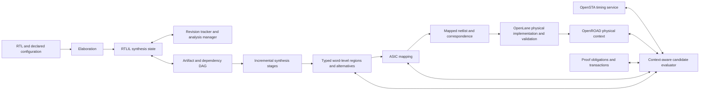

# Aggressive roadmap to upgrade Yosys ASIC synthesis toward state-of-the-art capability

Repository edition: 2026-09-07.

Navigation: [Execution plan](../../ASIC_EXECUTION_PLAN.md) · [Progress](../../ASIC_PROGRESS.md) · [OpenLane integration](OPENLANE_INTEGRATION_REPORT.md).

## Provenance and reading rules

This is a structured repository edition of the research report supplied by the project owner. It preserves the program's architectural proposals, source-level landing points, acceptance targets, benchmark methodology, R&D portfolio, resource assumptions, and risk register. Repeated conversational material and nonportable ChatGPT citation tokens have been normalized rather than presented as working GitHub citations. It is not a byte-for-byte conversation transcript or a newly reproduced research result.

The original report identified Yosys commit `435977e97008578a4532da60e70f75b5e88d076d`, dated September 4, 2026. Publication-time GitHub inspection confirmed that `phoenix-hacking/yosys-dev/main` was at that commit before these documentation additions. Its tree was `619f1ede8b8fb31305838ed2593f0d06058f2c67`; its ABC gitlink was `a51bf4a7bb38ce06ea3a544b1463b40832213917`. The `abc_new.cc` mapping boundary was also read during publication. These observations are not a complete source audit or a successful build.

Claims about external papers and commercial products below are inherited research leads. Their original conversational citation objects were not available as a portable bibliography. They must be checked against primary publications during the research-audit tasks before performance numbers or implementation dependencies are adopted. No commercial parity, benchmark speedup, memory reduction, or PPA improvement has been measured by publishing this document.

All new APIs, files, commands, schedules, percentages, and resource estimates are proposals unless explicitly described as existing. Where this report and the execution plan differ, the execution plan's correctness requirements and measured gates control implementation.

## 1. Executive summary

Yosys itself is the product under development. The objective is not to wrap stock Yosys in a flow manager or turn OpenROAD into the synthesis engine. The objective is to change Yosys source code so that ASIC synthesis of large heterogeneous designs becomes materially better than pinned stock Yosys in four dimensions:

1. Turnaround and scalability: incremental compilation, persistent artifacts, analysis reuse, lower memory consumption, bounded parallelism.
2. Quality of results: timing-aware and eventually physically aware optimization rather than only structural/local cost decisions.
3. Datapath intelligence: richer arithmetic and mux representations, multiple equivalent implementations, context-aware selection.
4. Correctness: explicit dependency invalidation, transactional transformations, formal proof obligations, reproducible differential regression.

The supported design families include CPUs, DSPs, GPU/SIMD logic, accelerators, NoCs/interconnect, memory interfaces, and control logic. This is ASIC standard-cell and hard-macro synthesis, not FPGA optimization.

The supplied inventory describes an upstream tree already containing experimental `abc_new`, Liberty/SCL caching, `opt_hier`, `arith_tree`, Booth multiplication, parallelism, SystemVerilog elaboration work, experimental OpenSTA integration, and performance fixes. Extend and harden these foundations rather than independently recreating them.

Incrementality cannot mean only “the module's RTL file did not change.” Cross-hierarchy constant, liveness, and tied-signal information can invalidate an unchanged parent's optimized artifact. The target requires an artifact/dependency DAG, boundary summaries, revisions, and conservative invalidation that becomes more precise through evidence.

The second architectural change is an analysis manager. RTLIL mutation monitoring, individual connectivity indexes, and pass execution hooks offer a basis, but each cached analysis needs an explicit validity contract. The third is context-driven implementation selection: timing, electrical load, library, physical context, and proof assumptions must inform optimization.

The preferred first production feature is persistent reuse of completed mapping jobs. The inspected `abc_new` path writes `input.box`, `input.map2`, and `input.xaig`, invokes `abc9_exe`, reads `output.aig`, and reintegrates through `abc_ops_reintegrate`. This is a bounded candidate cache boundary. Traditional `abc` must remain a baseline lane, and the first production backend should follow the measured OpenLane recipe rather than force a premature switch to experimental mapping.

Do not write a new STA, placer, router, or extraction engine. Reuse OpenSTA and OpenROAD through explicit adapters while Yosys retains synthesis decisions. OpenLane supplies the integration and physical-validation environment.

### Priority outcomes and proposed gates

| Rank | Program | Primary outcome | Proposed gate, not a measured result |
|---|---|---|---|
| P0 | Benchmark/profiling and correctness infrastructure | Trustworthy baseline | Every promoted patch has stock/fork results and required correctness evidence |
| P1 | Content-addressed artifacts and mapping cache | First persistent reuse | Cold overhead target ≤5%; hit restore target ≤10% original mapping-job time |
| P2 | Stage/module dependency DAG | Reuse synthesis stages | Target ≥4× median speedup on predeclared synthesis-dominated local edits |
| P3 | Analysis manager and pass invalidation | Avoid repeated analysis/work | Maintained analyses match fresh recomputation after adversarial edits |
| P4 | Capacity/memory and strict ASIC macros | Large-design survivability | Aspirational ≥30% RSS reduction on selected million-instance workloads |
| P5 | Persistent timing service | Timing as active synthesis input | Correct incremental timing and no silently lost constraints |
| P6 | Typed arithmetic/mux candidates | Better ASIC implementation choices | Aspirational ≥7% delay improvement at ≤5% area cost, or ≥5% area at matched timing |
| P7 | Physical feedback and local resynthesis | Better routed correlation | Held-out routed frontier improvement over fork without feedback |
| P8 | Sequential and equality-saturation research | Potential differentiated capability | Reproduced gains beyond conventional candidate search |

These thresholds are hypotheses for engineering gates. They must not be achieved by deleting difficult cases, changing reference conditions, hiding failures, or weakening correctness checks.

### Parity is multidimensional

Track capacity, cold runtime, local-edit turnaround, functional correctness, constraint coverage, PPA, physical correlation, ECO stability, and feature breadth separately. Pinned stock Yosys is the mandatory control. Commercial tools are architectural references and optional matched experimental references; licenses are not prerequisites for the core project.

The supplied mature north-star envelope suggested warm local edits at roughly 20–25% of stock clean time, controlled 10-million-mapped-instance capacity tests, and eventual timing/area gaps within approximately 5–10%/10% of a matched commercial reference on a restricted envelope. These are aspirations, not forecasts or claims. Open-PDK results do not establish advanced-node flagship-chip signoff parity.

## 2. Target architecture



Retain RTLIL as the authoritative synthesis IR. Use bounded region graphs as temporary optimization views, not a second independently mutable full-chip synthesis database. OpenDB owns committed physical state in the physical engine. A versioned correspondence boundary connects the systems.

Distinguish semantic identity, compilation identity, and optimization context. Functionally equivalent old implementations may remain useful candidates even when changed timing conditions invalidate an exact compilation cache hit.

## 3. Repository inventory and architectural gap

The following is a landing-point map inherited from the supplied research and anchored to the baseline. Confirm exact declarations and mutation behavior before each PR. File existence is not evidence that a proposed capability is implemented.

| Area | Existing source anchors | Planned extension |
|---|---|---|
| RTLIL objects/mutation | `kernel/rtlil.h`, `kernel/rtlil.cc` | Revision sidecars, audited mutation notifications, stable correspondence |
| Pass execution | `kernel/register.h`, `kernel/register.cc` | Optional effects/preservation contracts and mutation scopes |
| Connectivity | `kernel/sigtools.h`, existing `ModIndex` implementation | Shared analyses with conservative splitting/deletion invalidation |
| In-process hashes | `kernel/hashlib.h` | Separate persistent cryptographic content identity |
| Compact graphs | `kernel/compute_graph.h` | Evaluate as a bounded typed arithmetic-region container |
| Synthesis driver | `techlibs/common/synth.cc` | Explicit stage contracts and reusable boundaries |
| Repeated optimization | `passes/opt/opt.cc`, `opt_expr`, `opt_clean`, `opt_merge`, `opt_muxtree`, `opt_dff` | Dirty-module scheduling and audited analysis preservation |
| Hierarchical optimization | `passes/opt/opt_hier.cc` | Explicit consumed boundary facts and invalidation |
| Mapping | `passes/techmap/abc.cc`, `abc_new.cc`, `abc9_exe.cc`, `abc_ops_reintegrate.cc` | Exact job manifests, result reuse, later portfolios |
| Sequential-cell mapping | `passes/techmap/dfflibmap.cc` | Include actual sequential mapping inputs in dependencies |
| Mapping exchange | XAIG/AIG backends and mapping correspondence | Stable job serialization and reintegration contracts |
| Saved designs | `passes/cmds/design.cc`, RTLIL reader/writer | Stage artifacts without repeated full-design cloning |
| Timing | `passes/cmds/sta.cc`, `techlibs/common/opensta*` | External scenario-aware timing service, not a new STA engine |
| Arithmetic | `alumacc.cc`, `arith_tree.cc`, `booth.cc` | Alternative producers with exact finite-width semantics |
| Memories | `passes/memory/memlib.*`, `memory_libmap.cc`, `memory_map.cc` | Strict ASIC fallback policy and semantic macro identity |
| Formal | `passes/equiv/`, `passes/sat/`, external EQY/SBY | Local proof obligations, full-flow equivalence, failure classification |
| Tests/build | `tests/`, `CMakeLists.txt`, documented vanilla/unit infrastructure | Fast regressions plus pinned external ASIC benchmark lanes |

### Particular observations and cautions

`RTLIL::Monitor` includes mutation notifications and a blackout mechanism. The supplied report identifies `ModIndex` as an example of maintaining/reloading an analysis through monitoring. This is useful precedent, but direct public-field mutation must be audited; monitors must not be assumed to see every write.

The supplied report identifies `HasherDJB32` as a 32-bit internal hash. It is appropriate to retain efficient in-process containers. A persistent synthesis artifact must not rely on a 32-bit hash for identity.

`opt_hier` propagates constants, unused signals, and tied relations. Cross-boundary reuse therefore depends on facts consumed, not only ports or source content.

The normal generic synthesis driver is script-oriented. Reusing selected modules is not automatically equivalent to running the whole `synth` command on a partial selection. Isolated compilation-unit designs or explicitly audited stages are required.

The inspected `AbcNewPass::script()` has a concrete mapping loop and reintegration boundary. Its explicit experimental status must remain visible. Effective scripts can come from command arguments, scratchpad defaults, or module attributes; a cache key cannot cover only the visible command line.

The supplied inventory describes `libcache` as a parsed/consolidated library cache, not a mapping-output cache. Reuse its operational lessons where appropriate, but do not assume its key schema is sufficient for hardware-result reuse.

The internal `sta` pass described in the report is limited compared with full ASIC STA. The experimental external integration should not be confused with a persistent MCMM timing optimizer.

### Commercial-reference interpretation

The supplied research describes Design Compiler NXT in terms of RC estimation, congestion prediction, physical guidance, optimization, and multithreading; Fusion Compiler in terms of integrated implementation engines/data; Genus/iSpatial in terms of scalable logic/physical synthesis and implementation correlation. Treat these as vendor capability descriptions, not independently established numerical advantages.

The project should study the underlying capabilities rather than market labels. No statement here proves that commercial tools lack persistent candidates, incremental compilation, or adaptive optimization. Proposed differentiation must be demonstrated on an explicitly compared dimension.

## 4. Persistent artifact and dependency architecture

### Stage identity

Begin with `elaborated`, `coarse`, `technology-independent`, and `mapped` stages. Prefer matching raw consumed inputs to aggressive semantic canonicalization in version one.

```cpp
enum class ArtifactStage {
    Elaborated,
    CoarseOptimized,
    TechIndependent,
    Mapped
};

struct ContentDigest {
    std::array<uint8_t, 32> bytes;
};

struct ArtifactKey {
    ArtifactStage stage;
    ContentDigest semantic_input;
    ContentDigest recipe;
    ContentDigest tool_abi;
    std::vector<ContentDigest> dependencies;
    std::optional<ContentDigest> optimization_context;
};

class ArtifactStore {
public:
    std::optional<ArtifactHandle> lookup(const ArtifactKey &);
    ArtifactWriter begin_write(const ArtifactKey &);
    void commit(ArtifactWriter &&);
    ArtifactStats stats() const;
};
```

This is interface pseudocode, not compilable code already present in Yosys. Proposed files include `kernel/content_digest.*`, `artifact_store.*`, `artifact_manifest.*`, and an opt-in command under `passes/cmds/`.

Use explicit schema/domain tags and unambiguous length-delimited field encoding. Include ordered dependencies where order affects compilation. Pin byte order and string encoding. Do not hash ambiguous concatenations.

An artifact manifest should include producer/version, stage, source and dependency content identities, effective recipe, frontend/plugin/ABC identity, libraries, constraints actually consumed, boundary correspondence, output digests, and statistics.

```json
{
  "schema": 1,
  "stage": "mapped",
  "producer": {
    "yosys_commit": "435977e97008578a4532da60e70f75b5e88d076d",
    "stage_abi": "mapped-v1",
    "abc_digest": "sha256:..."
  },
  "inputs": {
    "semantic": "sha256:...",
    "recipe": "sha256:...",
    "libraries": ["sha256:..."],
    "constraints": "sha256:...",
    "dependencies": ["sha256:..."]
  },
  "outputs": {
    "rtlil": "sha256:...",
    "object_map": "sha256:..."
  },
  "stats": {
    "cells": null,
    "original_runtime_ms": null
  }
}
```

Numbers are null because this is a schema sketch, not an example benchmark result.

Start with the full producer build identity. Consider per-stage semantic ABI versions only after compatibility is deliberately specified and tested. A similar version string alone cannot establish compatibility across unrelated builds or plugins.

### Publication and integrity

```text
Compute complete key
 → acquire per-key publication lock
 → recheck existing entry
 → write unique temporary content
 → validate output and digests
 → flush as required by durability policy
 → atomically publish manifest
```

Readers never observe partially published entries. Failed jobs must never publish success entries. Corruption, incompatible schema, missing outputs, interrupted writes, and unsupported scripts cause safe recomputation.

Strong digests protect identity/integrity but do not authenticate an untrusted shared cache writer. Start with trusted local storage; remote sharing later needs authorization, signed provenance or equivalent trust policy, and poisoning tests.

Do not run expensive formal equivalence synchronously on every trusted exact cache hit. Exact reuse relies on matching consumed inputs, validation, deterministic replay, and a tested producer. Aggressive transformations have separate proof obligations. Sampled full proofs and clean comparisons remain part of validation.

### Dependency rules

A Liberty change invalidates stages consuming that library, not unrelated parsing. A package change invalidates actual elaboration consumers. A changed child boundary summary invalidates parent artifacts that consumed the changed facts. A changed physical context invalidates characterization/ranking while potentially retaining a proved implementation as a candidate.

Initially invalidate ancestors conservatively. Later store consumed summaries and narrow propagation only after differential tests establish soundness.

Names and paths can affect SDC, selection scripts, attributes, diagnostics, and output. Do not strip them indiscriminately to create cache hits. Exact-match and normalized semantic-reuse modes must remain distinct.

## 5. Analysis manager and pass-effect contracts

Keep revisions in sidecars initially; do not add large per-object metadata everywhere without memory measurement.

```cpp
enum class ChangeDomain : uint32_t {
    Names        = 1u << 0,
    Attributes   = 1u << 1,
    Connectivity = 1u << 2,
    CellFunction = 1u << 3,
    Sequential   = 1u << 4,
    Interface    = 1u << 5,
    Hierarchy    = 1u << 6,
    Memory       = 1u << 7,
    Process      = 1u << 8,
    Unknown      = 1u << 31
};

class AnalysisManager {
public:
    template<class Analysis>
    const Analysis &get(RTLIL::Module *);
    void invalidate(RTLIL::Module *, ChangeMask);
    void invalidate_all(RTLIL::Module *);
};
```

| Analysis | Principal invalidators |
|---|---|
| Driver/user index | Pin reconnection, object addition/removal, interfaces |
| Canonical signal map | Connectivity; splitting/deletion conservatively rebuilds scope |
| Hierarchy dependency graph | Instance type, module/interface changes |
| Liveness | Connectivity, observable interfaces, function changes |
| Structural fingerprint | Semantic attributes, connectivity, cell function/parameters |
| Boundary summary | Interface, child facts, hierarchy, constants/liveness |
| Timing correspondence | Object replacement, identity changes, connectivity |

Deletion is a critical case: union-find supports additions naturally, but removing an equivalence can split a component. V1 should rebuild affected connectivity scope rather than retaining stale unions.

Proposed pass metadata:

```cpp
struct PassEffects {
    ChangeMask may_change;
    AnalysisMask preserves;
    bool module_local;
    bool hierarchy_sensitive;
    bool deterministic;
};
```

Unannotated passes default to unknown and invalidate conservatively. Declared effects are not a substitute for audited mutation paths. In debug/shadow mode, compare observed changes and fresh analyses against declarations and fail on contradictions.

Start with repeated optimization passes. Improve module-level scheduling before a general fine-grained worklist. Liveness can propagate upstream; simplification downstream; structural merge opportunities can be nonlocal. A single immediate-fanout queue is insufficient.

A boundary summary can describe interface identity, constant facts, used-port facts, tied relations, and the exact assumptions imported from children. Record which facts a parent consumed.

Required validation: randomized legal RTLIL edits followed by maintained-versus-fresh analysis comparisons, sanitizer runs, pass-composition tests, and deliberate annotation faults.

## 6. Mapping-result reuse

The initial conservative job key should include extracted network bytes, box semantics/timing descriptions, mapping correspondence, complete effective library contents, effective mapper script, delay/load/driver controls, exclusions, executable/plugin identities, mapping ABI, and all relevant scratchpad/module overrides.

```text
digest(
    input.xaig,
    input.box,
    input.map2,
    effective libraries,
    effective constraints,
    effective script,
    mapper identity,
    mapping-stage ABI
)
```

Cache the mapper result, validated metadata, and diagnostic log. On a hit, use the current normal reintegration path. Keep correspondence in the exact key initially; name-independent graph reuse is a later research/engineering feature.

A repeated `AbcNewPass` invocation must not inherit unintended option state. The inspected class holds `abc_exe_options`; audit/reset semantics before trusting job identity, and add a two-invocation regression. This is an audit task, not a claim that a patch has already fixed it.

Unsupported custom scripts with undeclared files, environment-sensitive behavior, external side effects, or nondeterministic dependencies bypass caching. Do not guess their dependency set.

Traditional `abc` remains necessary because the selected OpenLane recipe may use it. Implement a backend-neutral cache contract, prove it on one supported path, then port to the other with backend-specific tests. Compare backends separately from cache effectiveness.

Proposed targets:

$$T_{hit} / T_{original\ mapping} \le 0.10,$$

$$O_{cold}=(T_{empty\ cache}-T_{cache\ disabled})/T_{cache\ disabled}\le 0.05.$$

Measure end-to-end synthesis as well; fast mapper restoration does not establish fast parsing, relinking, or export.

Tests include library changes preserving timestamps, script overrides, ABC binary changes, delay targets, `dont_use`, correspondence, shared modules, empty jobs, failed mapper runs, cancellation, corruption, simultaneous writers, eviction, and A→B→C→A histories.

## 7. Capacity, memory, and safe concurrency

Profile before selecting a replacement data structure. Separate source parsing, elaboration, optimization, mapping, serialization, linking, timing, and physical implementation.

Prefer bounded region/module snapshots to whole-design clones. Share immutable library/template data. Release temporary networks before retaining later representations. Use compact hot-path views and dense analysis indexes where measured benefits exceed synchronization overhead.

Track both parent Yosys memory and concurrent helper processes. Summing each process's independent peak is not a true concurrent process-tree peak; time-aligned sampling or an isolated job cgroup needs an explicitly described accounting policy. Record sampling interval and limitations.

A memory-aware scheduler should bound active mapping/proof jobs by estimated and measured high-water memory, not only core count. Workers operate on bounded snapshots and propose results; deterministic ordered commit occurs against revision preconditions. Avoid unrestricted concurrent mutation of global RTLIL state.

Capacity cases must distinguish repeated modules, heterogeneous designs, and very large single modules. Prevent generated logic from being optimized away. Report unique definitions, expanded mapped cells, sequential cells, pins, nets, macros, and macro memory bits separately.

Demonstrating a 10-million-cell load/checkpoint/timing initialization test does not demonstrate whole-chip high-effort remapping or full physical closure at that size. Publish capability boundaries separately.

## 8. ASIC memory and macro safety

Keep existing inference and `memory_libmap` machinery. Add a strict policy around unexpected fallback and model identity.

```cpp
struct MemorySemanticKey {
    uint64_t width;
    uint64_t depth;
    std::vector<ReadPortSemantics> reads;
    std::vector<WritePortSemantics> writes;
    MaskSemantics masks;
    CollisionSemantics collision;
    InitSemantics initialization;
};
```

Proposed behavior, not existing command promises:

```text
Report every inferred memory and selected implementation.
Fail when a large unmatched memory would become flop/decoder logic,
unless an explicit exception authorizes that implementation.
```

A conceptual CLI might include `memory_libmap -strict`, a JSON memory report, and a configured fallback-size threshold. Final syntax requires API review.

Fingerprint library rules, macro wrappers, timing models, functional models, masks, ports, latency, enables, collision semantics, clocking, and initialization. Identical dimensions do not establish interchangeable memory semantics.

Functional equivalence requires appropriate macro behavior models. A blackbox stub used for linking is not a proof of macro correctness. Physical abstract/LEF, timing Liberty, GDS/reference and power-pin consistency are separate integration checks.

## 9. Timing and constraint service

Do not expand a limited internal timing pass into another signoff engine. Expose a scenario-aware service using OpenSTA. Early integration may be file-based or a persistent sidecar, followed by incremental APIs once matching semantics are established.

```cpp
struct PinTiming {
    double arrival_rise;
    double arrival_fall;
    double required_rise;
    double required_fall;
    double slew_rise;
    double slew_fall;
    double load_cap;
    double setup_slack;
    double hold_slack;
};

class TimingService {
public:
    void load_scenario(ScenarioId, const ScenarioConfig &);
    void begin_update(NetlistRevision);
    void apply(const TimingEdit &);
    TimingRevision commit_update();
    PinTiming timing(ObjectId pin, ScenarioId) const;
    TimingSummary summary(ScenarioId) const;
};
```

Real interfaces must distinguish rise/fall, min/max, setup/hold, early/late, clock domain, scenario, unit scale, and unavailable values. Do not use NaN or zero interchangeably with missing timing.

A constraint-binding registry tracks references through rename, replacement, flattening, reconnection, and deletion. Each edit preserves a meaningful correspondence, transforms the constraint deliberately, rejects the change, or emits an explicit unsupported/error result. Silent loss is prohibited.

Changing netlist topology can invalidate loads and downstream/upstream timing beyond the edited region. Full clock/SDC/library changes may legitimately require global recomputation. Incrementality means avoiding unnecessary work, not guaranteeing every edit is local.

Compare maintained timing against a clean run on the identical netlist, constraints, and parasitics. Validate coverage and endpoint sets as well as summary values. A proposed 1 ps tolerance from the initial report is not universally appropriate; calibrate an absolute-plus-relative tolerance for pinned units, corners, precision, and repeated-run variation.

A sidecar can improve crash isolation and versioning. It is not a substitute for licensing review; process separation alone does not establish a legal conclusion about combined distribution.

## 10. Typed word-level alternatives

Use a bounded region IR extracted from RTLIL. Evaluate `ComputeGraph` rather than immediately introducing a heavyweight full-design graph.

```cpp
enum class ArithOp {
    Add, Sub, Mul, Mac, Compare,
    And, Or, Xor, Reduce,
    Mux, Extend, Truncate
};

struct ArithType {
    uint32_t width;
    bool is_signed;
    OverflowSemantics overflow;
    RoundingSemantics rounding;
};

struct ImplementationCandidate {
    ArithGraph graph;
    ProofObligation proof;
    CostEstimate estimate;
    ContextDigest characterized_context;
    ArtifactHandle reusable_artifact;
};
```

Explicit extensions, casts, truncation points, saturations, and roundings are mandatory. Fixed-width RTL is not unbounded integer algebra. Preserve cycle boundaries initially. Floating-point alternatives require separate treatment of rounding, exceptions, NaNs, signed zero, and fused versus separately rounded operations.

Refactor or wrap `alumacc`, `arith_tree`, and `booth` as alternative producers where feasible. Do not discard established implementations.

Initial candidate families:

- Carry-save versus conventional add/sub chains and final-adder alternatives.
- Compound MAC/multiplier regions where widths and truncation semantics permit composition.
- Arrival-aware reductions, not depth balance alone.
- Resource sharing versus duplication in late-select or critical-path contexts.
- Mux/priority restructuring with proved control relationships.
- Multi-output factoring where benefits survive changed input capacitance and fanout.

A small Pareto frontier is preferable to a single irreversible choice. Bound region size, candidates, proof budget, mapping effort, and physical evaluation effort. A previously proved candidate may be reused under matching proof assumptions, but cost characterization must be revalidated for changed context.

Evaluate legality and feasibility before optimizing area/power/churn. A smaller structure can hurt setup, hold, congestion, or input loading. False paths are timing declarations, not permission to change Boolean functionality.

## 11. Physical feedback and transaction architecture

The first physical provider is OpenROAD through a narrow, versioned interface. Avoid embedding OpenDB throughout the Yosys kernel.

```cpp
struct PhysicalContext {
    ContentDigest netlist_revision;
    ScenarioId scenario;
    LocationMap locations;
    NetSummaryMap nets;
    CongestionGrid congestion;
    MacroRegionSet macros;
    PhysicalFreshness freshness;
};
```

Include placement coordinates, pin locations, estimated/routed RC, net topology identity, macro/blockage context, units, clock treatment, library/constraint identity, and freshness. Preserve provenance through buffering, sizing, CTS, cloning, and route changes; a name-only map is not sufficient.

Cheap logical evaluation should prune candidates before expensive physical evaluation. Shortlist using consistent timing assumptions, then evaluate placement/parasitics and optionally route. Measure ranking accuracy and actual downstream gains, not only absolute prediction error.

A conceptual transaction:

```text
Propose bounded edit
 → validate preconditions and legality
 → build equivalence obligation
 → prove under explicit assumptions
 → evaluate timing/physical effects in isolated or reversible state
 → commit if acceptable; otherwise restore original state
```

```cpp
class TransformTransaction {
public:
    EditSet &edits();
    ProofObligation build_proof() const;
    bool commit();
    void rollback();
};
```

Rollback must restore connectivity, names/correspondence, revision state, analysis validity, constraints, and physical state as applicable. Error, timeout, and cancellation paths require fault-injection tests. A best-known checkpoint protects against quality regression during search.

An incremental change manifest should identify old/new logical digests and physical revision preconditions. The original report's added/removed-cell list is only an initial sketch. A real ECO consumer needs pin reconnections, legal cell/macro replacements, clock/power boundaries, changed constraints, and explicit unsupported categories.

OpenROAD local restructuring and incremental routing are useful building blocks, not proof of an existing arbitrary RTL-ECO flow. The first physical-ECO pilot should use a narrow pre-CTS combinational standard-cell edit; clock, sequential, macro, power-domain, interface and post-CTS cases require later gates or full rebuild.

## 12. Reproducible edit-replay and ASIC benchmark program

The test unit is a revision transition, not just a static RTL design.

```text
A: fork clean build with cache enabled; retain synthesis artifacts.

B1: stock Yosys clean build.
B2: fork clean build with artifact reuse disabled.
B3: fork incremental synthesis using A artifacts.

Prove all required B implementations against intended B RTL.
Assert invalidation and work performed.
Compare resources and mapped quality.
```

For OpenLane add full downstream runs for B1/B2/B3, then a distinct B4 lane with validated physical reuse. Populate A's physical state for B4 and record its cost separately. Add stock same-partition controls whenever compilation boundaries change.

### Correctness layers

1. Transformation correctness against intended updated RTL, with functional cell/macro models.
2. Maintained-versus-fresh analyses on the same updated design.
3. Explicit expected invalidation/reuse assertions.
4. Matched mapped and physical QoR measurements.

Formal outcomes: `PASS`, `COUNTEREXAMPLE`, `INCONCLUSIVE_TIMEOUT`, `INCONCLUSIVE_RESOURCE`, `INFRASTRUCTURE_ERROR`. Only `PASS` satisfies a required proof. A bounded search without an appropriate complete proof argument is not a full equivalence result.

The original report included illustrative EQY/SBY snippets. Treat solver names, engine options, depth and timeout configuration as version-dependent templates to validate; do not copy them into production CI without testing the pinned tool syntax and proof semantics.

### Adversarial edit matrix

| Edit | Required behavior |
|---|---|
| No change | Reuse valid artifacts; do not count only trivial no-ops as incremental success |
| Local logic | Rebuild changed unit and actual dependent summaries |
| Width/signedness | Rebuild affected elaboration/arithmetic/mapping work |
| Parameter/generate | Update specializations and hierarchy |
| Interface/port width | Re-elaborate callers and invalidate consumed interface facts |
| Shared module | Correctly affect every dependent specialization/instance context |
| Child constant/tie/liveness | Invalidate parent optimization when consumed facts change |
| Package/include/define | Invalidate actual consumers with conservative fallback |
| Liberty/script/ABC/exclusion | Invalidate affected mapping/characterization |
| SDC/clock/load | Revalidate timing context; do not invent front-end dependencies |
| Memory/macro library | Re-evaluate semantics and strict fallback |
| Rename/delete/recreate | Prevent stale identity resurrection |
| Cache corruption | Reject entry and rebuild |
| Interrupted publication | Never expose a partial hit |
| Revision reversal | Exact valid old entries may be reused; stale state may not persist |

Required histories include A→B→C→A, branching from an earlier revision, delete-and-recreate under the same name, library-change-and-revert, and repeated mapping invocations in one process.

### Workload coverage

| Family | Small fixtures | Larger candidate sources / stress |
|---|---|---|
| DSP | FIR/MAC, FFT butterfly, signed multiply, saturation | Pinned DSP blocks; large arithmetic regions |
| GPU/vector | SIMD lanes, predicates, reductions, arbiters | Selected Vortex blocks and heterogeneous lanes |
| CPU/control | Decode, ALU, scoreboard, bypass | Ibex and selected larger control blocks |
| Interconnect | Crossbar, FIFO bank, DMA, register subsystem | PULP AXI configurations |
| Floating point | Exact-format proof fixtures | Selected CVFPU blocks, separate semantic envelope |
| Memory | Port/mask/latency/collision fixtures | Cache-control blocks with modeled SRAMs |
| Capacity | Repeated and heterogeneous generators | 10k/100k/1M then controlled 5M/10M cases |
| Single large module | Observable mux/arithmetic graph | Region incrementality stress |

External sources must be pinned by full revision, top, file ordering, parameters, defines, frontend, generated RTL identity, licensing, and proof/physical configuration. Never silently fetch latest main.

### Proposed repository layout

```text
tests/asic_incremental/
  harness/
  common/
  cases/
  expected/
benchmarks/asic/
  toolchain.lock.json
  designs/
  transitions/
  configs/
  schemas/
  scripts/
integrations/openlane/
  plugin/
  schemas/
  tests/
docs/asic-roadmap/evidence/
```

These are planned locations. The presence of this document does not create the harness, scripts, plugin, lock, or evidence directories.

### Metric schema requirements

Record case/transition/mode, source and tool identities, library and constraint digests, wall/CPU time, memory accounting policy, cache lookup/hit/miss time, hashing/loading/storing time, bytes, job counts, historically weighted reuse, mapped cells/area, timing by scenario, unconstrained endpoints, physical outcomes, proof status/time, and failure/cancellation status.

Missing metrics must be null with a reason, not fabricated zero values.

$$S_{incremental}=T_{stock\ clean}(B)/T_{fork\ incremental}(A\rightarrow B)$$

$$S_{reuse}=T_{fork\ clean}(B)/T_{fork\ incremental}(A\rightarrow B)$$

$$R_{weighted}=\frac{\sum_{reused\ jobs}T_{historical\ clean\ job}}{\sum_{all\ jobs}T_{historical\ clean\ job}}$$

Include hashing, linking, loading and export in end-to-end synthesis time. Report validation time separately and as total validated turnaround. Cache-hit percentage alone is not evidence of useful work avoidance.

Use fixed-floorplan comparisons and separate utilization/floorplan sweeps. A fixed utilization with changed cell area generally changes core size, so it is not the same control as an identical floorplan.

Preserve failed runs and negative outliers. Use held-out designs, edit histories, a second library, repeated physical runs, and a declared aggregation method. Do not report percentages of negative WNS as a general performance metric; use period/delay ratios and absolute slack differences with clear definitions.

## 13. Phased program and original effort assumptions

The original research assumed an eight-person experienced core team and proposed the following overlapping program. These are planning assumptions, not a delivery promise, staffed commitment, or automatic schedule.

| Phase | Original effort window | Deliverable | Exit evidence |
|---|---|---|---|
| Baseline/oracle | Months 0–2 | Reproducible stock/fork tests and profiling | Wrong netlists detected; environment pinned |
| Mapping reuse | Months 2–5 | Digest/CAS/manifests and mapper cache | Cold/hit overhead measured; invalidation correct |
| Dependency DAG | Months 4–9 | Stage/module reuse | Real local-edit gains; stale-history suite passes |
| Analysis reuse | Months 7–12 | Revisions/effects/dirty optimization | Maintained equals fresh; bounded cold overhead |
| Capacity/macros | Months 9–14 | Memory fixes, strict fallback, budgets | Measured capacity improvement and no silent expansion |
| Timing | Months 12–18 | Scenario service and SDC lifetime | Same-design fresh/incremental agreement |
| Word-level candidates | Months 15–22 | Typed regions and alternatives | Formal plus matched ASIC Pareto gains |
| Physical feedback | Months 18–26 | Context and physical-aware selection | Gains survive held-out implementation |
| Research convergence | Months 24–36 | Bounded EqSat/sequential/adaptive work | At least one reproducible added-value result |

The actionable backlog supersedes calendar estimates. Reestimate after the baseline, first cache, and first timing-service prototypes using observed development and verification effort. A four-person or single-engineer program cannot simply execute all tracks concurrently.

Stop expanding scope when the existing mechanism has not passed its gate. A poor local-edit speedup may be caused by parsing, linking, output, one changed large module, or broad legitimate invalidation. Profile before adding complexity. Poor candidate ranking calls for model/correlation work, not more unbounded recipes.

## 14. Stretch research portfolio

Potential leapfrogging means a demonstrated advantage on a specific dimension, not an assertion about undisclosed commercial internals.

### Persistent context-specific implementation portfolios

Retain a bounded set of proved implementations for one semantic region: minimum area, late-input timing, late-select timing, low input capacitance, low congestion footprint. Re-rank them after context changes before launching fresh synthesis.

Evaluate frontier coverage, cross-revision reuse, cache/storage costs, proof-assumption validity, and total time to target PPA. Characterization reuse across libraries requires remapping/recharacterization; a cell implementation is not portable merely because the arithmetic operation is.

### Bounded technology-aware equality saturation

The supplied report cites E-Syn and E-morphic as research leads for e-graph exploration and technology-aware extraction. Reproduce primary artifacts and benchmark conditions before adopting their claimed gains.

Start with bounded typed arithmetic/control regions, width-safe rewrites, growth limits, multiple extracted candidates, equivalence, and mapped/routed evaluation. Whole-chip saturation is deferred because growth, extraction cost, and physical-context modeling are separate hard problems.

### Learned physical candidate ranking

The supplied report names PigMAP and the September 2026 LevelSyn preprint as leads for moving physical information earlier. The original report treats LevelSyn as very recent and not established methodology. Verify publication and artifacts before reliance.

Train a ranking model rather than a signoff predictor. Use graph/topology, arrival/load, fanout, macro context, placement estimates and congestion. Hold out entire designs and library/context regimes; report top-k selection regret and final routed PPA, not only training fit.

Machine learning may prioritize candidates. It may not bypass formal proof, constraint checks, or physical validation. A deterministic fallback remains available.

### Certified sequential optimization

The supplied report identifies “Certified Sequential Sweep Without Unrolling” as a July 2026 lead. Verify the actual publication, assumptions, certificates, and artifact availability.

Start with one clock, explicit synchronous reset/init semantics, no memory crossing, and a defined I/O latency relation. Add bounded retiming, state correspondence, sequential proof and certificate checking before broader sequential resynthesis.

State mapping, reset, enable, scan, clock-gating and latency behavior are mandatory proof concerns. Combinational equivalence is not sufficient for moved registers.

### Solver-guided local synthesis and proof reuse

Use bounded local cones or multi-output windows. Generate exact proof obligations from cutpoints. Explore SAT/SMT-based resynthesis only where search cost is justified by criticality. Cache proofs only with complete function/assumption/cell-model/engine semantics identity.

Differentiate “solver reported success” from independently checkable certificates where available. Research tractable proof composition; do not assume that proofs of isolated blocks imply whole-chip equivalence under arbitrary changed assumptions.

### Adaptive optimization policy

The supplied report describes commercial adaptive-flow claims as vendor claims, then proposes an open action scheduler using recorded design/context/action/runtime/proof/QoR data.

Begin with a bounded action set: do nothing, cheap rewrite, deep mapping, arithmetic alternatives, physical characterization, reopen a cached block, or increase proof effort. Optimize time to target PPA under fixed budgets. Compare simple heuristics, exhaustive bounded policies, and learned/bandit approaches.

### Distributed content-addressed compilation

Only after local correctness: share immutable artifacts with tenant isolation, provenance, authorization, quotas, cancellation, fault recovery and deterministic commit order. Measure total resources and communication, not only local elapsed time. Proprietary RTL, libraries and physical data must not leak to public caches.

### Stability-aware ECO optimization

Make implementation churn an explicit objective under functional/timing/physical constraints. Track changed cells, moved cells, disturbed nets, routed wire change and regenerated clocks. Compare against exact synthesis plus full implementation and conventional bounded ECO baselines.

Do not preserve a stale or poor implementation merely to maximize reuse. Reopen boundaries when constraints or measured quality require it.

| Research direction | Initial feasibility assessment | Main gate |
|---|---|---|
| Persistent candidate portfolio | High after timing/physical infrastructure | Useful re-ranking across real histories |
| Bounded typed EqSat | Medium/high research | Exact semantics and controlled growth |
| Learned physical ranking | Medium | Held-out generalization and routed benefit |
| Certified sequential optimization | Medium prototype, harder production | Valid state/reset/latency proof |
| Solver-guided local resynthesis | Medium | Benefit per search/proof budget |
| Adaptive action scheduling | Medium/high after data collection | Time-to-quality gain without overfit |
| Distributed artifact compilation | Medium after local maturity | Trust, determinism and resource efficiency |
| Whole-chip EqSat/new STA/new P&R | Not an initial priority | Avoid unfocused duplicate infrastructure |

## 15. PR-sized landing map

The original report proposed these implementation categories and rough code-size bands. LOC is not a progress metric or a firm estimate. The first-24-PR queue in the execution plan supplies the actual initial ordering and task IDs.

| Change | Approximate original size band | Critical validation |
|---|---:|---|
| Strong digest and canonical encoding | 700–1,200 LOC | Known vectors, field boundaries, mutation |
| CAS/manifests/atomic publication | 1,200–2,000 | Corruption, crash, concurrency |
| Cache command/stats | 400–700 | Enable/disable/path and counters |
| Mapping cache integration | 800–1,400 | Backend-specific inputs and reintegration |
| Edit-replay harness | 1,000–1,800 | Independent runs and oracle faults |
| Revision tracking | 800–1,200 | Mutation classes and blackout |
| Analysis manager | 1,000–1,600 | Fresh/cached differential |
| Pass-effects API | 500–900 | Conservative defaults |
| Hot-pass annotations | 600–1,000 | Actual mutation and preservation |
| Dirty-module scheduling | 700–1,200 | Fixed-point equivalence |
| Boundary summaries | 1,000–1,600 | Child constant/tie/liveness changes |
| Stage export/import/link | 1,200–2,000 | Structural/functional round trips |
| Dependency DAG | 1,200–2,000 | Propagation and histories |
| Incremental driver | 1,500–2,500 | Real edits and fallback |
| Elaboration pilot | 1,500–3,000+ | Packages/parameters/generates |
| Stable correspondence | 800–1,300 | Rename/delete/recreate/reload |
| Timing abstraction | 800–1,300 | Mock backend and units |
| Persistent timing prototype | 2,000–3,500 across components | Clean/incremental differential |
| Constraint registry | 1,500–2,500 | Deleted/rebound SDC references |
| Typed arithmetic IR | 1,500–2,500 | Width/sign/truncation semantics |
| Arithmetic extraction | 1,200–2,000 | Roundtrip proof |
| Candidate generators | 2,500–4,500 | Per-family equivalence and quality |
| Pareto evaluator | 1,000–1,800 | Feasibility and deterministic ranking |
| Proof integration | 1,000–1,800 | Failure/inconclusive rejection |
| Physical schema | 700–1,200 | Freshness and correspondence |
| OpenROAD provider | 1,500–2,500 | Object/topology consistency |
| Physical evaluator | 1,500–2,500 | Matched characterization |
| Strict memory/report | 400–700 | Large unmatched memory |
| Memory semantic key | 700–1,200 | Mask/port/collision variants |
| Macro dependencies | 800–1,400 | Model/library changes |
| Transaction API | 1,000–1,800 | Rollback/fault injection |
| Bounded proof API | 1,200–2,000 | Valid and invalid replacements |
| Sequential research prototype | 3,000–6,000+ | SEC corpus and assumptions |

Prefer independently upstreamable compiler infrastructure and opt-in behavior. Do not make Yosys core depend on a particular OpenLane PDK or runner. Integration code belongs in a narrow plugin/adapter layer.

## 16. Resource assumptions and governance

The original eight-FTE scenario allocated one lead/architect, two incremental/compiler engineers, one mapping engineer, one timing/constraint engineer, one arithmetic/research engineer, one formal engineer, and one performance/physical-integration engineer. These are staffing scenarios, not requirements to begin the first tranche.

Original hardware planning tiers were roughly 16–32 cores/64 GB for development, 64–96 cores/256 GB for larger synthesis/formal runs, and 512 GB–1 TB for selected capacity experiments. These are planning ranges to validate with the actual corpus; do not purchase infrastructure solely from them. Storage speed and cache locality are experimental variables.

Use fast PR checks, extended proof/timing checks, controlled nightly-scale runs, and milestone physical/held-out tests. Suggested time budgets in the original report are not configured automation. Large benchmarks should not make every documentation PR run a whole implementation farm.

Core governance rules:

- Evidence precedes completion. Every completed task links the implementation commit, exact commands/tool lock, tests, benchmark artifacts where relevant, and limitations.
- Unknown, blocked, not run, timeout and failed are separate states.
- Documentation completion is not synthesis feature completion.
- Commit count, elapsed calendar days and LOC do not establish percentage completion.
- Keep baseline identity immutable; introduce new baseline series explicitly after rebases.
- Keep proprietary data, cell libraries, commercial logs and design artifacts out of public Git history unless redistribution is authorized.
- Upstream submission and local implementation are separate status fields.

## 17. Risk register

| Risk | Severity | Required mitigation |
|---|---|---|
| Unsound cache hit | Critical | Complete consumed-input keys, conservative fallback, corruption tests, differential proofs |
| Missing hierarchy dependency | Critical | Ancestor invalidation first; explicit consumed summaries before precision |
| Excess invalidation | High | Measure propagation and residual cost before narrowing |
| Cold hashing/serialization overhead | Medium | End-to-end overhead gate and profiles |
| Cache storage explosion | Medium | Quotas, eviction, dependency-safe GC, measured compression |
| Cached analyses increase RAM | High | Lazy construction, byte accounting, budgets/eviction |
| Identity resurrection | High | Generation-aware IDs and explicit correspondence |
| Incorrect pass declarations | Critical | Audited events, shadow checks, unknown invalidation |
| Lost timing constraints | Critical | Registry, coverage, fresh differential timing |
| Stale physical context | High | Revision/topology/scenario identity and invalidation |
| Incremental QoR drift | High | Exact versus ECO modes, clean controls, periodic reopening |
| Proof dominates runtime | High | Bounded windows, correspondence, budgets; inconclusive candidates rejected |
| Benchmark overfit | High | Held-out designs/histories, second library, fixed reporting |
| Unsupported commercial-parity claim | High | Matched experimental evidence and capability-specific wording |
| Upstream divergence | High | Small opt-in patches, regular audit/rebase, no premature IR rewrite |
| Nondeterministic concurrency | High | Snapshot workers, revision preconditions, ordered commit |
| Scope expands into entire implementation stack | High | Strict Yosys/OpenSTA/OpenROAD/OpenLane responsibilities |
| Shared-cache poisoning/data disclosure | Critical | Trust boundaries, access control, authenticated provenance, isolation |
| Licensing assumptions | High | Review actual dependency/distribution terms; sidecar is not legal proof |
| Weak formal models | Critical | Functional libraries/macros and deliberately wrong-netlist tests |

## 18. Evidence and optimization provenance

Record each accepted aggressive transformation with semantic region digest, old/new implementation digest, exact proof obligation and result, timing/physical revisions, candidate alternatives, before/after metrics, and reason for acceptance.

```json
{
  "transformation": "arith_candidate_replace",
  "semantic_region": "sha256:...",
  "old_impl": "sha256:...",
  "new_impl": "sha256:...",
  "proof": {
    "status": "PASS",
    "engine": "pinned-engine-id",
    "obligation": "sha256:..."
  },
  "context": {
    "timing_revision": null,
    "physical_revision": "sha256:..."
  },
  "before": {"area": null, "setup_slack": null},
  "after": {"area": null, "setup_slack": null}
}
```

The schema above is illustrative. Null values make its non-measured status explicit.

Open reproducibility and inspectable decisions can differentiate the project before it wins every PPA comparison. That advantage still requires actual reproducible artifacts, not simply a promise of transparency.

## 19. Source anchors and research-audit backlog

### Publication-time verified repository anchors

- [Baseline commit](https://github.com/phoenix-hacking/yosys-dev/commit/435977e97008578a4532da60e70f75b5e88d076d).
- [Baseline tree](https://github.com/phoenix-hacking/yosys-dev/tree/435977e97008578a4532da60e70f75b5e88d076d).
- [Inspected `abc_new.cc`](https://github.com/phoenix-hacking/yosys-dev/blob/435977e97008578a4532da60e70f75b5e88d076d/passes/techmap/abc_new.cc).
- [Contribution guidance](https://github.com/phoenix-hacking/yosys-dev/blob/435977e97008578a4532da60e70f75b5e88d076d/CONTRIBUTING.md).

### Integration references checked at publication

- [OpenLane custom steps](https://openlane2.readthedocs.io/en/latest/usage/writing_custom_steps.html).
- [OpenLane custom flows](https://openlane2.readthedocs.io/en/stable/usage/writing_custom_flows.html).
- [ORFS variables](https://openroad-flow-scripts.readthedocs.io/en/latest/user/FlowVariables.html).

These documentation links are mutable references, not a pinned toolchain. The baseline work must record exact implementation revisions and local source anchors for the chosen OpenLane generation.

### Inherited research leads requiring primary-source audit

Basilisk (2024); E-Syn; E-morphic; PigMAP; LevelSyn (reported September 2026); Certified Sequential Sweep Without Unrolling (reported July 2026); SmaRTLy; public Synopsys DC NXT/Fusion Compiler and Cadence Genus/iSpatial capability documentation; OpenROAD local restructuring and timing APIs; EQY safe-replacement semantics and proof strategies.

For each lead, archive title/authors/version/date, primary URL, code/data revision, license, claimed comparison, actual metric (AIG versus mapped/routed ASIC), reproduction commands, reproduced result or failure, and applicability to this project. Do not invent missing bibliographic details or treat a citation title as a reproduced result.

## 20. Closing design principle

> First make Yosys remember. Then make it understand what changed. Then make it understand timing. Then let it retain multiple correct implementations. Finally, let physical context choose among them.

The execution plan turns this principle into checkable tasks and measurable milestones. Its first deliverable is a trustworthy baseline and edit-replay oracle, followed by one safe native mapping-cache path. The final aspiration is proof-carrying, content-addressed, context-specific ASIC synthesis that preserves useful knowledge across real design revisions.
